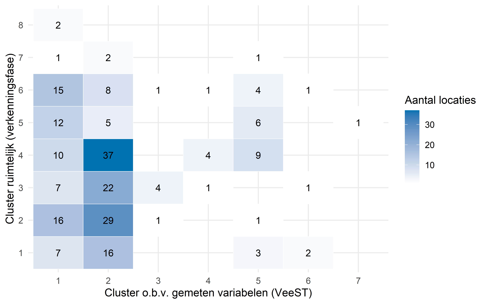
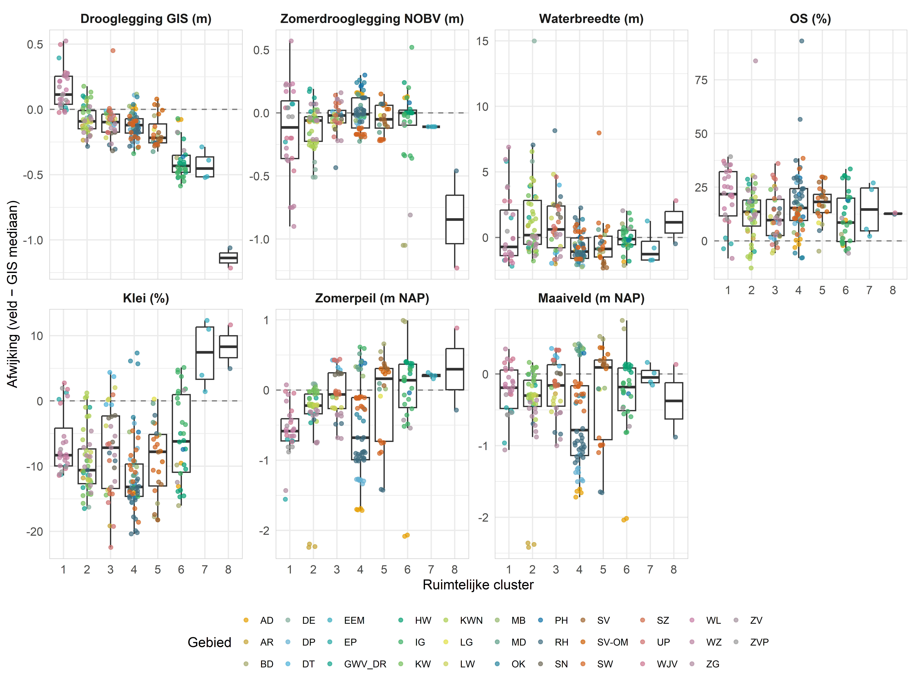
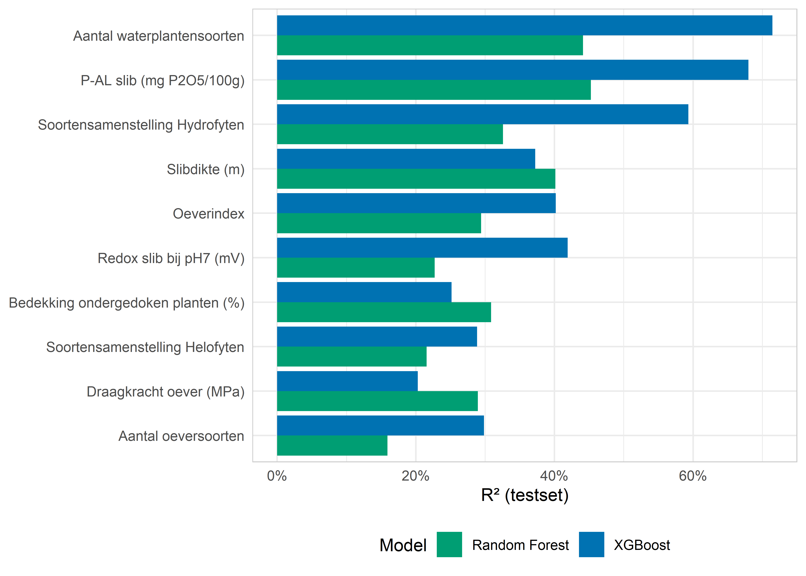

::: {.cell}

:::


::: {.cell}

:::


# Inleiding

Dit rapport beschrijft de resultaten van de modelleringsanalyse uitgevoerd binnen het VeeST-project (Veenweiden Sloot van de Toekomst). Het doel van de modellering is het kwantificeren van de relaties tussen abiotische en beheersvariabelen enerzijds en ecologische wensbeeldparameters anderzijds (met als eindperspectief het kunnen sturen op beheermaatregelen om die wensbeelden te realiseren).

De analyses zijn uitgevoerd op een gecombineerde dataset van veldmetingen (WP1 en WP2), gefilterd op monsters (meettraject en meetmoment) met complete abiotische én vegetatieopnamen. 

# Methoden

## Data en voorspellende variabelen

De dataset bevat locatiemetingen van meerdere waterschappen. Voor de XGBoost- en Random Forest-modellen (hieronder) is de data eerst gefilterd op `MeenemenDataAnalyse_totaal == 'ja'`: een vlag die aangeeft welke meting per sloot representatief is voor de reguliere situatie. Deze filter is nodig omdat WP2-sloten in sommige gevallen in meerdere jaren en/of onder meerdere experimentele behandelingen zijn bemeten; zonder filtering zou zo'n sloot meerdere keren in de dataset voorkomen en zwaarder meewegen dan sloten met één meting, en zouden proefbehandelingen (die niet representatief zijn voor reguliere bedrijfsvoering) meegenomen worden als reguliere waarnemingen. Na deze filtering en de aanvullende `complete.cases()`-filtering per doelvariabele (verwijdering van rijen met ontbrekende waarden in doelvariabele of voorspellende variabelen) blijven gemiddeld ~190 sloten per doelvariabele over; een klein aantal sloten (10) komt ook na filtering nog met twee meetjaren voor, omdat er voor die sloten meerdere als "ja" gemarkeerde metingen bestaan. Na deze kwaliteitsfiltering op volledigheid en unieke trajecten per sloot (slechts één behandeling per sloot is meegenomen, waarbij de proefbehandelingen zijn weggelaten) zijn 33 voorspellende variabelen geselecteerd, verdeeld over:

- **Hydrologische variabelen**: drooglegging, maximale waterdiepte, doorzicht, waterbreedte
- **Oeverstructuur**: breedte oevervegetatiezone 2a en 2b, taludhoek, onderholling, oeverbreedte
- **Bodemchemie (0–25 cm)**: kleigehalte, organisch stofgehalte, CEC, draagkracht
- **Waterchemie en slibkwaliteit**: water-pH, chloride, ammonium, P-AL, redox, FeP-verhouding
- **Beheersvariabelen**: baggerfrequentie en -moment, maaifrequentie, mestmethode, koebelasting

De tien doelvariabelen zijn:


::: {#tbl-targets .cell tbl-cap='Overzicht van gemodelleerde doelvariabelen'}
::: {.cell-output-display}


|Variabele                       |Nederlandse naam                   |Eenheid      |
|:-------------------------------|:----------------------------------|:------------|
|waterzone_1_subm_tot_perc       |Bedekking ondergedoken planten (%) |%            |
|n_soorten_oev_zone2             |Aantal oeversoorten                |soorten      |
|oeverindex                      |Oeverindex                         |-            |
|n_soorten_sub_zone1             |Aantal waterplantensoorten         |soorten      |
|Soortensamenstelling Helofyten  |Soortensamenstelling Helofyten     |-            |
|Soortensamenstelling Hydrofyten |Soortensamenstelling Hydrofyten    |-            |
|draagkracht_oever               |Draagkracht oever (MPa)            |MPa          |
|slib_redox_pH7                  |Redox slib bij pH7 (mV)            |mV           |
|P-AL mg p2o5/100g_SB            |P-AL slib (mg P2O5/100g)           |mg P2O5/100g |
|max_slib                        |Slibdikte (m)                      |m            |


:::
:::


### Toegepaste datatransformaties of standaardisaties

#### Methode toedienen mest

Deze mestmethode is gecategoriseerd naar verwachtte belasting van het perceel, waarbij een hoge belasting (door zwaardere machines of frequentere bemesting) een hogere waarde heeft dan geen belasting. De belasting is vertaald naar de volgende klassen:

| Waarde | Categorie |
|--------|-----------|
| 0 | "n.v.t./onbekend" of "n.v.t" |
| 1 | "sleepslang" |
| 2 | "sleepslang en mesttank" |
| 3 | "mesttank" |
| 4 | "bovengronds_strooier" |
| 5 | "injecteren" |

#### Redox genormaliseerd voor pH7

De formule stamt uit de Nernst-vergelijking. De redoxpotentiaal (Eh) is pH-afhankelijk omdat bij veel redoxreacties in de bodem waterstofionen (H⁺) betrokken zijn. Per pH-eenheid stijging daalt Eh met ~59 mV (bij 25°C). Door te normaliseren naar pH 7 worden metingen van locaties met verschillende pH vergelijkbaar:

$$Eh_7 = Eh_{\text{gemeten}} + (7 - pH_{\text{gemeten}}) \times 59$$

#### FeP-verhouding

Berekend als molverhouding.

#### Kengetallen op basis van profielen

- Drooglegging oever en perceel: zowel het hoogste punt op de oever als het maaiveld minus jaarrondstreefpeil (NHI)
- Zomerdrooglegging: maaiveld minus zomerpeil (NOBV)
- Taludhoek boven water rond de waterlijn: tan⁻¹(hoogteverschil oever en waterlijn / horizontale afstand), waarbij van alle oeverpunten die minder dan 35 cm boven de waterlijn liggen het punt wordt genomen dat het verst van de waterlijn af ligt, met de insteek als maximale grens.
- Taludhoek onder water rond de waterlijn: tan⁻¹(hoogteverschil bovenkant slib op 35 cm verticale afstand onder de waterlijn en waterlijn / horizontale afstand).
- Taludhoek boven water : tan⁻¹(hoogteverschil oever op 3 meter horizontale afstand van de waterlijn en waterlijn / horizontale afstand). Als de oever minder breed is dan 3 meter dan wordt het oeverpunt dat het verst van de waterlijn ligt genomen, met de insteek als maximale grens.
- Taludhoek onder water: tan⁻¹(hoogteverschil bovenkant slib op 1 meter horizontale afstand van de waterlijn en waterlijn / horizontale afstand). 
- Breedte oeverzone: breedte van de zone van insteek tot waterlijn.

#### Proxies voor draagkracht van de oever en het perceel

- check berekening draagkracht op basis van de formule van Van den Akker (2004) met een functie van het organisch stofgehalte, kleigehalte en CEC. 
- De draagkracht is gemeten met een pentrometer langs een traject loodrecht op de oever, hierbij zijn drie zones gemeten: zone 1 = oeverzone, zone 2 = insteek, zone 3 = perceel. In verschillende zones is de gemiddelde draagkracht voor verschillende diepteintervallen berekend:

  - Diepteintervallen van 10 cm van 0 tot 80 cm 
  - Diepteintervallen die relevant zijn voor beworteling van oevervegetatie: 0–15 cm, 15–40 cm, 40–80 cm
  - Diepteinterval draagkracht oever: 0-40 cm

Daarnaast is de minimale draagkracht per zone berekend en de diepte waar deze is gemeten.

#### Diagnostiek: spreiding draagkracht in de tijd versus tussen gebieden

Draagkracht perceel (50–80 cm diepte) en draagkracht oever worden in de erosieindex- en vernattingsrisico-componentenplots als diagnostisch paneel getoond (draagkracht perceel telt mee in de erosieindexformule; draagkracht oever niet). Om te beoordelen hoe stabiel deze maten zijn, is voor locaties met metingen in twee of meer jaren de standaarddeviatie over de tijd berekend (within-locatie spreiding) en vergeleken met de standaarddeviatie tussen gebiedsgemiddelden (tussen-gebied spreiding).


::: {.cell}
::: {.cell-output-display}


|Component                   | Aantal meerjarige locaties| Aantal locaties totaal| Within-locatie SD (tijd)| Tussen-gebied SD| Totale SD|
|:---------------------------|--------------------------:|----------------------:|------------------------:|----------------:|---------:|
|Draagkracht perceel 50-80cm |                        101|                    266|                    0.110|            0.104|     0.188|
|Draagkracht oever           |                        100|                    265|                    0.068|            0.077|     0.117|


:::
:::


Voor beide draagkrachtmaten is de spreiding binnen een locatie over de tijd van vergelijkbare orde van grootte als de spreiding tussen gebieden. Bij draagkracht perceel is de within-locatie spreiding zelfs licht groter dan de tussen-gebied spreiding; bij draagkracht oever is de tussen-gebied spreiding iets groter dan de within-locatie spreiding, maar het verschil is klein. Dit betekent dat een deel van de verschillen die in de gebieds-boxplots zichtbaar zijn, niet uitsluitend structurele verschillen tussen gebieden weerspiegelt, maar mede door jaar-op-jaar-variatie op dezelfde locatie kan worden verklaard (bijvoorbeeld door seizoensinvloeden, meetvariatie of lokale veranderingen).

#### Koebelasting drinkende koeien

Deze afgeleide variabele geeft een proxy voor de belasting van de oever door koeien die uit de sloot drinken (relevant voor vertrapping en begrazing van de oever). De afleiding volgt een beslisregel op basis van vier brondata: aanwezigheid van afrastering langs de sloot, of koeien al dan niet uit de sloot drinken, aanwezigheid van drinkbakken, en het aantal koeien/koedagen per perceel:

- Is de sloot (deels) afgerasterd (uitrasteringspercentage > 0%), dan wordt de koebelasting op 0 gezet (koeien hebben dan geen toegang tot het water).
- Is bekend dat koeien niet uit de sloot drinken, dan wordt de koebelasting eveneens op 0 gezet.
- Ontbreken het aantal koeien per perceel per dag of het aantal koedagen per jaar, dan is de koebelasting onbekend (NA).
- In overige gevallen wordt de koebelasting berekend als:

$$\text{Koebelasting} = \text{Aantal koeien/perceel/dag} \times \frac{\text{Aantal koedagen/jaar}}{365} \times \text{Natte omtrek oever}$$

waarbij de natte omtrek van de oever een maat is voor hoeveel slootoever daadwerkelijk bereikbaar is voor drinkende koeien. Vrij-tekstwaarden voor drinkgedrag en drinkbakaanwezigheid (bijv. "ja"/"nee"/"onbekend"-varianten) zijn eerst genormaliseerd naar TRUE/FALSE/NA.

## Clusteranalyse abiotische variabelen

Om te onderzoeken welke abiotische variabelen sloten het beste van elkaar onderscheiden, is een k-means-clusteranalyse uitgevoerd op alle beschikbare abiotische metingen (bodem-, slib- en waterchemie, textuur, hydrologie). Deze analyse is complementair aan de vergelijking met de ruimtelijke GIS-clusters (zie hierboven): waar die vergelijking uitgaat van vier vooraf gedefinieerde variabelen, gebruikt deze analyse alle beschikbare metingen om te bepalen welke variabelen sloten daadwerkelijk het sterkst van elkaar onderscheiden.

### Variabelenselectie


::: {.cell}
::: {.cell-output .cell-output-stdout}

```
Vanuit 1026 oorspronkelijke kolommen zijn achtereenvolgens verwijderd: 44 administratieve/identificatie-kolommen, 52 kolommen zonder variatie binnen een jaar, 196 kolommen gemeten met de LIAB- of M3-methode (behalve kleigehalte, zie onder), en 43 kolommen die handmatig zijn uitgesloten wegens sterke redundantie met een andere variabele (zie @tbl-manual-exclude). Van de resterende 658 kandidaatvariabelen hadden er 427 een dekking van minstens 75% van de waarnemingen; deze zijn gebruikt voor de clustering, samengevat per sloot als mediaan over alle beschikbare metingen en meetjaren. Na het verwijderen van variabelen zonder resterende variatie bleven er 427 variabelen over voor de uiteindelijke k-means-clustering (@tbl-parametertabel-bijlage), gebaseerd op 192 sloten.
```


:::
:::


Bodem- en slibmetingen met de LIAB- of M3-extractiemethode zijn uitgesloten omdat deze methoden in dit project slechts voor een deel van de locaties betrouwbaar zijn gemeten (en gevalideerd) en daardoor systematisch minder dekking geven dan de overige methoden (behalve het kleigehalte, dat wel is aangehouden). Daarnaast zijn er handmatig variabelen uitgesloten die een andere, al opgenomen variabele sterk overlappen: omdat ze dezelfde parameter in een andere eenheid of met een andere (sterk gecorreleerde) methode meten, of omdat ze in twee compartimenten (oever op diepte 0-25 en diepe 25-50) sterk met elkaar samenhangen. Een aantal van deze uitsluitingen betreft XRF-totaalgehalten in de vaste matrix van het slib (Mg, Al, K, Ti, Ga) die onderling sterk correleren omdat ze grotendeels dezelfde onderliggende bron delen: het aandeel kleimineralen (lithogene fractie) in het sediment. Al, K en Mg maken deel uit van het kleimineraalrooster zelf, Ti komt als resistent mineraal mee met de fijne (klei/silt) korrelfractie, en Ga vervangt Al isomorf in datzelfde rooster (hierdoor meten deze elementen grotendeels hetzelfde textuursignaal in plaats van onafhankelijke geochemische processen). @tbl-manual-exclude (bijlage) geeft deze uitsluitingen weer, inclusief de onderbouwing per keuze.

### Log-transformatie van fosforvariabelen


::: {.cell}
::: {.cell-output .cell-output-stdout}

```
De volgende variabelen zijn sterk rechtsscheef verdeeld (een klein aantal hotspot-sloten domineert anders de Euclidische afstand in kmeans) en zijn daarom met log10() getransformeerd vóór het standaardiseren (scale()) en clusteren, niet alleen in de boxplot-visualisatie: AL_CO_mmol+/kg_OR_25, AL_CO_mmol+/kg_OR_50, feS_CC_SB, feS_DW_SB, feS_CC_OR_25, feS_CC_OR_50, feS_XRF_OR_25, feS_XRF_OR_50, feS_PW, MO_CO_mmol+/kg_OR_25, MO_CO_mmol+/kg_OR_50, P_CC_mg/kg_OR_25, P_CC_mg/kg_OR_50, P_CC_mg/kg_SB, P_CO_mmol-/kg_OR_25, P_CO_mmol-/kg_OR_50, P_mmol/kg DW_SB, P2O5_xrf_g/kg_OR_25, P-AL mg p2o5/100g_SB, P-AL mg p2o5/100g_OR_25, P-PO4_CC_mg/kg_OR_25, P-PO4_CC_mg/kg_OR_50, P-PO4_CC_mg/kg_SB, Cl_mg_l_PW.
```


:::
:::


### Relatie tussen fosfor- en ijzervariabelen

Fosfor (P) en ijzer (Fe) zijn in de bodem en het slib nauw met elkaar verbonden: ijzer(hydr)oxiden binden fosfaat, waardoor de beschikbaarheid van fosfor mede wordt bepaald door de hoeveelheid (reactief) ijzer. Dit wordt onder andere weerspiegeld in de Fe/P-verhouding als maat voor de fosforbindingscapaciteit van bodem of slib. Omdat P en Fe in de dataset op meerdere manieren zijn gemeten (verschillende compartimenten: oever, slib, poriewater; verschillende extractiemethoden: totaal-P (XRF), P-AL, P-PO4 (CaCl2-extractie); Fe via CaCl2-extractie of XRF), zijn de onderlinge correlaties tussen alle P- en Fe-gerelateerde variabelen in de clusteranalyse hieronder in kaart gebracht.


::: {.cell}
::: {.cell-output-display}
{#fig-pfe-matrix width=2700}
:::
:::


Uit deze matrix (en de bijbehorende Pearson-correlaties in @fig-pfe-matrix-pearson in de bijlage) blijkt dat sommige P-variabelen onderling sterker correleren dan met de Fe-variabelen, en dat de Fe/P-ratio's vooral door de Fe-concentratie worden gedreven (zie ook @tbl-manual-exclude, waarin de Fe/P-ratio op oeverdiepte 0–25 cm om die reden is uitgesloten ten gunste van de losse Fe-maat). Een deel van de P-variabelen (totaal-P in slib, P-AL en P2O5-XRF op oeverdiepte 0–25 cm) bleek daarnaast op slootniveau sterk gecorreleerd (Pearson r doorgaans > 0.8), maar deze correlatie werd grotendeels bepaald door een klein aantal sloten met sterk verhoogde P- waarden en chloride in het poriewater ("hotspots in Assendelft"): de rangcorrelatie (Spearman) tussen dezelfde variabelen lag duidelijk lager (doorgaans 0.4–0.5), wat erop wijst dat de samenhang buiten deze hotspot-sloten veel zwakker is; Hoge totaal-P gehalten in de oever (de veenpercelen) hebben geen sterke relatie met de P-AL of P in het poriewater in het slib (Spearman r < 0.24 en < 0.001). Om te voorkomen dat deze hotspots de clustering onevenredig sterk zouden sturen via de Euclidische afstand die k-means gebruikt, zijn deze P-variabelen met een log10-transformatie behandeld (zie hierboven); dit vermindert de invloed van de hotspot-sloten op de clustering zelf, niet alleen op de visuele weergave in @fig-clusteranalyse-boxplot.

## Vergelijking meting met veensloottypen (clusteranalyse geografische data verkenningsfase)

De VeeST-meetlocaties zijn geselecteerd op basis van acht veensloottypen (clusters) die in de verkenningsfase ruimtelijk zijn bepaald op basis van vier GIS-variabelen: drooglegging (AHN3 maaiveld minus jaarrondstreefpeil uit NHI), waterbreedte, organisch stofgehalte (25 cm) en kleigehalte (25 cm). Om te beoordelen hoe representatief de veldmetingen zijn voor deze typen, zijn de gemeten abiotische waarden vergeleken met de GIS-clusterwaarden via twee complementaire analyses:

1. **Schaalbereik-vergelijking**: per variabele worden de P10, mediaan en P90 vergeleken tussen GIS-laag (NOBV) en VeeST-velddata.
2. **Clusterovereenkomst**: per VeeST-locatie wordt bepaald bij welk GIS-cluster de gemeten waarden het beste passen en dit wordt vergeleken met het ruimtelijk toegewezen cluster uit de verkenningsfase. Elk GIS-cluster heeft een centroïde: de gemiddelde waarde van de vier clustervariabelen (drooglegging, waterbreedte, OS, klei) over alle locaties in dat cluster. De gemeten waarden van een VeeST-locatie worden vervolgens vergeleken met de centroïden van alle acht clusters. Omdat de variabelen in heel verschillende eenheden zijn uitgedrukt (meters vs. procenten), worden ze eerst gestandaardiseerd: elke waarde wordt uitgedrukt als het aantal standaarddeviaties ten opzichte van het gemiddelde van de GIS-populatie. Op die manier wegen alle vier variabelen even zwaar mee in de vergelijking. De "afstand" van een locatie tot een cluster is dan de rechte lijn in deze gestandaardiseerde ruimte (vergelijkbaar met hoe je de afstand tussen twee punten op een kaart berekent, maar dan in vier dimensies tegelijk). De locatie wordt toegewezen aan het cluster waar die afstand het kleinst is.

Een algemene kanttekening: een deel van de VeeST-gebieden valt buiten de geografische dekking van de oorspronkelijke clusterkaart. Voor deze gebieden is het cluster toegewezen op basis van ruimtelijke nabijheid, het dichtstbijzijnde cluster, niet per se een representatief referentietype. De gerapporteerde bias voor zulke gebieden zegt meer over hoe goed het toegewezen cluster past dan over een echte afwijking ten opzichte van een representatief type, en is daardoor minder informatief.

## XGBoost (eXtreme Gradient Boosting)

XGBoost (eXtreme Gradient Boosting) is een ensemblemethode gebaseerd op sequentieel opgebouwde beslisbomen. Gradiënt boosting analyse (XG-Boost) houdt rekening met complexe relaties tussen meerdere variabelen (type beheer, beheerfrequentie én omgevingsvariabelen). Dit type analyse doet recht aan het feit dat in de natuur relaties complex zijn waardoor het resultaat betrouwbaarder is dan een (multiple) regressieanalyse. Er wordt bijvoorbeeld geen effect verwacht van beheer op ondergedoken waterplanten in zeer voedselrijke watersystemen waar geen ondergedoken waterplanten voorkomen.

Voor deze studie is een XGBoost-model getraind op basis van omgevings- en beheer gerelateerde variabelen en doelvariabelen die representatief zijn voor de veenweidesloot van de toekomst. 

De implementatie maakt gebruik van gradient boosting (XGBoost) in R met de volgende instellingen:

- Splitsing: 60% train / 20% validatie / 20% test
- Early stopping na 20 rondes zonder verbetering op de validatieset (niet de testset)
- Maximale boostronden: 500; leersnelheid (eta): 0.05; maximale boomdiepte: 4
- Regularisatie: L2 (lambda = 2), minimaal bladgewicht (min_child_weight = 5), minimale splitwinst (gamma = 0.1)
- Subsampling: 80% rijen en kolommen per boom

Deze hyperparameters zijn niet via een formele tuning-procedure (bijvoorbeeld grid search met kruisvalidatie) geoptimaliseerd, maar vooraf vastgezet op waarden die conservatief zijn afgestemd op de relatief kleine datasetomvang van VeeST (circa 110-130 sloten na filtering, zie Methoden). Een uitgebreide hyperparameter-tuning met kruisvalidatie zou bij deze n al snel zelf overfitten op de validatieset: met zo weinig sloten is de kans groot dat een tuning-procedure een combinatie van instellingen "vindt" die toevallig goed past bij de specifieke train/validatie-split, zonder dat dit een echt beter generaliserend model oplevert. In plaats daarvan is gekozen voor instellingen die de modelcomplexiteit uit voorzorg beperken: een lage leersnelheid (eta = 0.05) met veel mogelijke boostronden (tot 500) in combinatie met early stopping laat het model voorzichtig en incrementeel leren, een beperkte boomdiepte (4) en hoog minimaal bladgewicht (min_child_weight = 5) voorkomen dat individuele bomen te veel op kleine subgroepen sloten worden toegesneden, en de toegevoegde L2- en gamma-regularisatie ontmoedigen splitsingen die weinig aan de voorspelkracht toevoegen. Dit is een bewuste, behoudende keuze om overfitting te beperken gegeven de beperkte steekproefomvang, ten koste van mogelijk iets minder scherp afgestemde prestaties per doelvariabele dan een volledige tuning-procedure zou opleveren.

De belangrijkheid van voorspellende variabelen is bepaald op twee manieren: via de ingebouwde Gain-maatstaf (informatiewinst per splitsing) en via permutation importance op de validatieset (gemiddelde RMSE-stijging bij het willekeurig permuteren van een kolom, herhaald over 5 replicaties).

### Ruimtelijke cross-validatie (leave-one-waterschap-out)

Om te testen of modellen generaliseren naar ruimtelijk nieuwe gebieden is een leave-one-waterschap-out cross-validatie uitgevoerd voor zowel XGBoost als Random Forest. Per fold wordt één waterschap volledig uit de trainset gehouden en als testset gebruikt. Correcties toegepast:

- Folds met minder dan 3 testlocaties of minder dan 20 trainlocaties zijn weggelaten
- Waterschappen met minder dan 10 testlocaties zijn uitgesloten van de R²-plot (te klein voor betrouwbare schatting)
- RMSE% (RMSE als percentage van het gemiddelde van de doelvariabele) is gebruikt voor vergelijkbaarheid tussen doelvariabelen met verschillende eenheden

## Random Forest

Random Forest bouwt, net als XGBoost, een ensemble van beslisbomen, maar dan onafhankelijk van elkaar (in plaats van sequentieel). Dit gebeurt via twee vormen van willekeur die samen "bagging" (bootstrap aggregating) worden genoemd:

- **Bootstrap sample**: elke boom wordt getraind op een eigen, willekeurig getrokken subset van de trainset, waarbij evenveel sloten worden getrokken als er in de trainset zitten, maar met terugleggen (dezelfde sloot kan dus meerdere keren in één subset voorkomen, en sommige sloten helemaal niet). Elke boom ziet daardoor een net iets andere versie van de data.
- **Willekeurige selectie van voorspellende variabelen**: op elke splitsing binnen een boom wordt niet naar alle voorspellende variabelen gekeken, maar slechts naar een willekeurige subset daarvan.

Doordat de bomen zowel op verschillende data-subsets als met verschillende subsets van voorspellende variabelen worden gebouwd, zijn ze onderling minder gelijkvormig; het middelen van hun voorspellingen ("aggregating") maakt het eindmodel minder gevoelig voor toevallige patronen in individuele voorspellende variabelen of specifieke sloten in de trainset (overfitting). Bijkomend voordeel: de sloten die niet in de bootstrap-sample van een boom zaten ("out-of-bag", OOB) kunnen worden gebruikt om die boom te toetsen, wat een ingebouwde validatiemaatstaf oplevert zonder aparte validatieset.

Random Forest is geïmplementeerd in R, met dezelfde train/validatie/test-opsplitsing als XGBoost:

- Splitsing: 60% train / 20% validatie / 20% test (zelfde seed als XGBoost niet van toepassing; eigen seed `5823` voor het model zelf)
- Aantal bomen: 500
- Aantal voorspellende variabelen per splitsing (mtry): $\lfloor\sqrt{p}\rfloor$, waarbij $p$ het totaal aantal voorspellende variabelen is (standaardwaarde voor regressie)
- Minimale knoopgrootte: 5 (een knoop wordt niet verder gesplitst als deze minder dan 5 waarnemingen bevat)
- Belangrijkheid van voorspellende variabelen: permutation importance (gemiddelde toename in MSE wanneer de waarden van een voorspellende variabele willekeurig worden geschud, herberekend per boom en gemiddeld over het bos)
- OOB-fout (R² en RMSE op de out-of-bag samples) beschikbaar als interne validatiemaatstaf, naast de aparte validatie- en testset

## GAM met ruimtelijke smoothing

Als aanvullend interpretatiemodel is per doelvariabele een Generalized Additive Model (GAM) gefit, uitgerust met:

- Univariate smooths voor de top-5 voorspellende variabelen in het XGBoost-model (op basis van permutation importance, niet gain: permutation importance meet het verlies aan voorspelkracht op ongeziene data wanneer een voorspellende variabele wordt geschud, en is daarmee minder gevoelig voor bias richting variabelen die veel unieke waarden of veel niveaus hebben dan gain)
- Een tweedimensionale ruimtelijke smooth (op basis van lengte- en breedtegraad) om gebiedseffecten op te vangen
- Penalisatie via `select = TRUE` (REML): normaal gesproken laat het model wel wat kromming in elke smooth staan, ook als een voorspellende variabele er eigenlijk niet toe doet. Met `select = TRUE` mag een smooth ook helemaal plat (naar nul) worden getrokken, alsof de voorspellende variabele uit het model is gehaald. Zo functioneert dit als een automatische variabeleselectie: onbelangrijke voorspellende variabelen verdwijnen vanzelf, terwijl belangrijke voorspellende variabelen hun vorm behouden.

Het GAM wordt naast XGBoost en Random Forest gebruikt omdat het, in tegenstelling tot deze twee ensemblemethoden, expliciet interpreteerbare, gladde (smooth) relaties tussen voorspellende variabele en doelvariabele oplevert: voor elke voorspellende variabele is direct af te lezen of en hoe het verband niet-lineair is, inclusief betrouwbaarheidsband, in plaats van alleen een globale importantiescore. Daarnaast is een GAM met penalisatie (REML/`select = TRUE`) beter geschikt voor de relatief kleine datasetomvang van VeeST (circa 200 unieke sloten): het aantal te schatten parameters is laag en expliciet beperkt via de smoothing-penalty, waardoor het model minder snel overfit dan een boom-ensemble met veel voorspellende variabelen en betrekkelijk weinig waarnemingen. XGBoost en Random Forest hebben doorgaans meer data nodig om stabiele, generaliseerbare splitsingen te leren (een voorspellend model), met name wanneer veel voorspellende variabelen onderling gecorreleerd zijn.

Een belangrijke beperking is dat het hier gefitte GAM, met alleen univariate smooths per voorspellende variabele plus de aparte ruimtelijke smooth, geen interacties tussen voorspellende variabelen modelleert zoals dat wel in de boom-ensembles gebeurt. Combinatie-effecten tussen bijvoorbeeld beheer en omgevingsvariabelen (die XGBoost en Random Forest wél impliciet meenemen doordat boomsplitsingen op meerdere variabelen tegelijk kunnen inspelen) blijven in het GAM buiten beschouwing. Het GAM dient in dit rapport dus als aanvullend, interpretatiegericht model naast XGBoost en Random Forest, niet als vervanging: de ensemblemodellen blijven leidend voor het vangen van complexe, niet-additieve relaties, terwijl het GAM vooral inzicht geeft in de vorm van de belangrijkste univariate verbanden en ruimtelijke restpatronen.

# Resultaten

## Overeenkomst veensloottypen op basis van ruimtelijke clusters vs. variabele-gebaseerde clusters

Per VeeST-locatie is op basis van de vier gemeten variabelen (drooglegging, waterbreedte, OS, klei) het dichtstbijzijnde GIS-cluster bepaald via de Euclidische afstand in de gestandaardiseerde variabelenruimte (z-scores op basis van de GIS-populatieparameters). Dit variabele-gebaseerde cluster is vervolgens vergeleken met het ruimtelijk toegewezen cluster uit de verkenningsfase.


::: {.cell}
::: {.cell-output-display}
{#fig-cluster-vergelijking width=2400}
:::
:::


De overeenkomst tussen ruimtelijk en variabele-gebaseerde clusterindeling geeft aan in hoeverre de GIS-clustertypen ook in de gemeten data onderscheidbaar zijn. Een lage overeenkomst wijst op systematische afwijkingen tussen GIS-laag en veldmeting (zoals de OS- en droogleggingsverschillen die hieronder worden besproken), of op grote variatie binnen clusters.

De overall overeenkomst bedraagt slechts 18.7% (veel lager dan bij een willekeurige toewijzing zou worden verwacht). Dit lage percentage is te verklaren door twee samenhangende effecten die elkaar versterken:

- **Hoge OS in VeeST**: de veldmetingen hebben structureel hogere OS-waarden (mediaan 36%) dan de GIS-laag (mediaan 21%). Cluster 2 heeft in de GIS-indeling de hoogste OS-waarde (30%) en trekt daardoor de meeste VeeST-locaties aan.
- **Kleine drooglegging in VeeST**: de gemeten drooglegging in VeeST (mediaan 0.33 m) past het best bij cluster 1 (GIS-mediaan 0.21 m) en cluster 2 (0.37 m) (de clusters met de kleinste drooglegging in de GIS-indeling). Clusters 3 t/m 8 hebben hogere droogleggingen (0.44–1.36 m) en vallen daardoor af.

Doordat beide effecten in dezelfde richting wijzen (hoge OS én kleine drooglegging leiden beiden naar cluster 1 of 2) komen vrijwel alle locaties bij die twee clusters terecht. Dit is zichtbaar in de verwarringsmatrix als een concentratie van getallen in de eerste twee kolommen.

Dit betekent niet dat de clusterindeling uit de verkenningsfase onjuist is, maar dat de GIS-laag en de veldmeting verschillende schaalniveaus beschrijven en zijn gebaseerd op verschillende bronnen, waarbij de relatieve waarde van variabelen vergelijkbaar is maar de absolute waarde niet. De GIS-laag representeert een gemiddeld perceel binnen een gemiddeld peilvak in het Nederlandse veenweidegebied, terwijl de VeeST-metingen oevers en sloten op standplaatsniveau in beeld heeft gebracht. De clusterindeling blijft zinvol als ruimtelijk kader, maar de absolute drempelwaarden voor OS, klei en drooglegging zijn niet direct vergelijkbaar tussen GIS en veld. 

### Schaalbereik GIS-laag vs. veldmeting


::: {.cell}
::: {.cell-output-display}
{#fig-cluster-bereik width=3600}
:::
:::


Voor de meeste variabelen (waterbreedte, klei, OS, maaiveld, zomerpeil) verschilt het schaalbereik van de GIS-laag en de veldmeting. Opvallende systematische verschillen:

**Organisch stofgehalte (OS)** is in de VeeST-veldmetingen structureel hoger dan in de GIS-laag: mediaan VeeST 36% vs. GIS 21% (een verschil van +15 procentpunt). Dit is te verwachten: de GIS-laag (obv NMI bodemSchat5) is een bredere representatie van alle bodemtypen, ook bodems met een laag OS gehalte. Het ruimtelijk model waarmee deze kaart is gemaakt is getraind op een dataset die niet specifiek is geselecteerd op veenweidelocaties, waardoor hoge OS-waarden worden onderschat in het model.

**Kleigehalte** is in VeeST lager dan in de GIS-laag: mediaan VeeST 15% vs. GIS 23%, een verschil van 8 procentpunt. Dit hangt samen met de hogere OS in VeeST: locaties met veel organisch materiaal hebben doorgaans minder klei. De selectie op veenweidelocaties leidt dus tegelijkertijd tot hogere OS én lagere klei ten opzichte van de brede GIS-populatie.

**Drooglegging** toont in VeeST een systematisch verschil tussen de drie bronnen:

- GIS-clusteranalyse (drlg): mediaan ~0.49 m, gebaseerd op AHN3 maaiveld minus jaarrondstreefpeil uit NHI.
- Zomerdrooglegging NOBV: mediaan ~0.47 m, gebaseerd op maaiveld minus zomerpeil.
- VeeST veldmeting (drglg): mediaan ~0.33 m, berekend als gemeten maaiveld minus gemeten waterpeil tijdens het veldbezoek.

Het verschil tussen de GIS-clusteranalyse en de Zomerdrooglegging NOBV (~0.02 m) is klein en te verklaren doordat beide methoden vergelijkbare peilen gebruiken; het verschil dat resteert is vooral het gevolg van het gebruik van een jaarrondpeil (GIS-cluster) versus een zomerpeil (NOBV). Een zomerpeil is doorgaans hoger dan het jaargemiddelde, waardoor de zomerdrooglegging iets kleiner uitvalt dan de GIS-clusterdrooglegging.

Het verschil tussen de NOBV zomerdrooglegging (~0.47 m) en de VeeST veldmeting (~0.33 m) bedraagt ~0.14 m. Dit is consistent met het verschil in maaiveld (GIS − VeeST: +0.34 m) minus het verschil in peil (GIS − VeeST: +0.20 m): 0.34 − 0.20 = 0.14 m, wat bevestigt dat de meting intern consistent is.

De spreiding (P10–P90) in de VeeST-veldmeting van drooglegging (0.32 m) is opvallend veel kleiner dan de spreiding in maaiveld (~1.86 m) en zomerpeil (~1.77 m) afzonderlijk. Dit is wiskundig te verwachten: maaiveld en waterpeil covariëren sterk (r = 0.98 in VeeST). Binnen individuele peilgebieden volgt het peil het maaiveld grotendeels, waardoor hun verschil (de drooglegging) weinig varieert. De variatie die wel bestaat in maaiveld en peil is grotendeels gedeelde regionale variatie die wegvalt bij aftrekking. De NOBV-zomerdrooglegging heeft een grotere spreiding (0.68 m) dan de VeeST-meting (0.32 m), omdat de NOBV-dataset een groter geografisch bereik dekt en de correlatie tussen maaiveld en peil iets lager is in deze NOBV-dataset (r = 0.95) dan de dataset van VeeST (r = 0.98). Dit kleine correlatieverschil leidt tot een substantieel grotere spreiding in het verschil; In de VeeST-dataset bewegen waterpeil en maaiveld perfect met elkaar mee, terwijl in de NOBV-dataset het waterpeil het maaiveld iets minder goed volgt, waardoor er meer spreiding in het verschil (drooglegging) ontstaat. In de NOBV-dataset kan het maaiveld binnen één peilvak behoorlijk variëren, terwijl het op papier vastgestelde peil gelijk is in ruimte en tijd en niet gelijk hoeft te zijn aan het werkelijke gemiddelde peil.

### Afwijking per cluster en per gebied


::: {.cell}
::: {.cell-output-display}
{#fig-cluster-afwijking width=3600}
:::
:::


De afwijkingen per gebied zijn niet gelijkmatig verdeeld over de clusters: sommige gebieden wijken systematisch af voor drooglegging (negatieve bias: veldmeting lager dan GIS), wat wijst op (lokale) peilafwijkingen of peilwijzigingen die niet in de GIS-laag met peilvakken staan.

De drooglegging-bias is voor de meeste gebieden negatief: de VeeST-veldmeting geeft een kleinere drooglegging dan de GIS-clusterwaarde. De sterkste negatieve bias zit bij Idzegea (IG, −0.42 m), gevolgd door Hegewarren (HW, −0.41 m) en Blesdijke (BD, −0.27 m). In Hegewarren en Stein Noord is de oorzaak dat de gemeten waterpeilen hoger zijn dan het mediane zomerpeil van het veenslootype (waterpeilen zijn hier recent verhoogd en deze verhoging staat nog niet geregistreerd in de gebruikte ruimtelijke bestanden van het NOBV). Ook in veel andere gebieden is het gemeten peil hoger dan de mediane peilwaarde van het GIS-cluster; in de meeste gevallen is de afwijking echter klein (−0.05 tot −0.15 m) en hangt dit samen met de variatie in het waterpeil binnen het GIS-cluster (deze variatie is niet te zien in bovenstaand figuur). Het maaiveld is in de meeste gebieden juist lager dan het GIS-clustermediaan. De combinatie van een hoger peil en een lager maaiveld leidt tot een grotere negatieve bias in de drooglegging.

Het maaiveld verschilt sterk in Aarlanderveen (AR), Assendelft (AD) en Akkerdijkse polder (DP): het gemeten maaiveld aan de slootkant (~−3.2 tot −4.3 m NAP) ligt ~2 m lager dan de clustermediaan (~−1 tot −1.9 m NAP). Belangrijk hierbij is dat de clustermediaan de **mediane waarde van alle locaties in dat GIS-cluster** is, verspreid over het hele veenweidegebied (er zit dus ook spreiding in de GIS-data zelf). De grote afwijking voor AD en AR betekent niet per se dat de GIS-laag fout is, maar dat deze locaties aan de onderkant van de spreiding van hun cluster vallen: ze liggen in diepere polders of onderbemalingen. Zowel maaiveld als peil zijn ~2 m lager dan de clustermediaan, waardoor de twee afwijkingen elkaar grotendeels compenseren en de drooglegging-bias klein blijft (−0.03 tot −0.16 m). 

De OS-bias is voor vrijwel alle gebieden positief (VeeST hoger dan GIS), zoals hierboven besproken. 

### Oppervlaktewaterpeilen VeeST meting tov praktijkpeilen in GIS laag (NOBV)


::: {.cell}
::: {.cell-output-display}
{#fig-peil-vergelijk width=3300}
:::
:::


Het mediaan verschil over alle locaties is slechts −0.035 m (over het algemeen klopt het NOBV zomerpeil dus goed). Maar er is duidelijke gebiedsspecifieke variatie:

Positief verschil (gemeten hoger dan NOBV, peilopzet): Hegwewarren, Poppenhuizen, Olde Maten staan bovenaan (waterpeilen zijn hier in werkelijkheid hoger dan het NOBV-zomerpeil aangeeft), mede omdat peilen hier recent zijn verhoogd en dit nog niet op de kaart staat.
Negatief verschil (gemeten lager dan NOBV): Eempolder, polder Westzaan, Zuiderveen, Blesdijke en het Wormer- en Jisperveld vallen op. In Westzaan en het Wormer- en Jisperveld komt dit omdat er veel onderbemalingen zijn die niet in de kaart van het NOBV staan. In de andere gebieden is het niet duidelijk waar het verschil door wordt veroorzaakt; wat wel opvallend is, is dat het peil in Blesdijke volgens de deelnemer verhoogd is (waar kan ik info vinden over de GLB pilot?) terwijl het peil op deze locaties ongeveer gelijk is aan het praktijkpeil, terwijl het peil op andere locaties in hetzelfde gebied veel lager liggen dan het praktijkpeil. 

Waterpeilen zijn in werkelijkheid vaak lager dan het peilbesluit. Dit kan komen omdat peilen recent zijn verlaagd en dit niet op de kaart staat of omdat peilen in praktijk lager worden gehouden/ er meer onderbemalingen zijn. Lage peilen zijn onwenselijk voor veenafbraak en broeikasgasemissies en deze worden dus onderschat als oppervlaktewaterpeilen in de basisdata van het NOBV hoger zijn dan in werkelijkheid.


## Clusteranalyse abiotische variabelen

Op basis van 427 abiotische variabelen (@tbl-parametertabel-bijlage) zijn de sloten via k-means ingedeeld in 8 clusters. Onderstaand figuur toont voor de 16 variabelen met het hoogste onderscheidend vermogen (eta², het aandeel variantie tussen clusters t.o.v. de totale variantie) de spreiding per cluster.

De volledige lijst van variabelen die zijn gebruikt in de clustering, met parameter, methode, eenheid en compartiment zoals gedefinieerd in de parameter-metadata, staat in @tbl-parametertabel-bijlage in de bijlage.


::: {.cell}
::: {.cell-output-display}
{#fig-clusteranalyse-boxplot width=3600}
:::
:::


Wat opvalt is dat de variabelen die het meest onderscheidend zijn (hoogste eta²) vooral chemische eigenschappen en vegetatie in de sloot (niet op de oever) betreffen, terwijl de oeverstructuur- en vegetatie op de oever relatief weinig bijdragen aan het onderscheid tussen clusters. 

Trofie veen is lager in cluster 3, 4, 6 en 8 (laagste trofiegehalte in veen) dan in de overige clusters. Cluster 3, 4 en 6 hebben ook de hoogste aantallen soorten waterplanten (zie @fig-clusteranalyse-boxplot), P-AL in slib is het laagst en Fe-P is het hoogst in deze clusters. Totaal-P in de oever is wel lager in cluster 3 en 4, maar juist niet in cluster 6. De relatie tussen de hoeveelheid P in de oever en de hoeveelheid P in het slib is ook zeer zwak (@fig-pfe-matrix) en dus niet eenduidig. 


::: {.cell}
::: {.cell-output-display}
{#fig-clusteranalyse-kaart-158 width=3000}
:::
:::


::: {.cell}
::: {.cell-output-display}
{#fig-clusteranalyse-kaart-23467 width=3000}
:::
:::


- **Cluster 1** is het grootste cluster (58 sloten) en neemt qua bijna alle variabelen een tussenpositie in tussen 2 en 4, met relatief het hoogste fosforgehalte in het slib (P_CC).
- **Cluster 2** heeft relatief hoog trofiegehalte in het veen én het soortenarmst (mediaan 1 soort). Ook de hoogste Ga/MgO (vaak gepaard met kleiafzettingen) en het laagst in chlorideconcentratie.
- **Cluster 3** (Eempolder en Idzegea) valt op door de relatief laagste P-totaal in de oever en Barium in het slib.
- **Cluster 4** springt er sterk uit door een zeer hoog opgelost ijzergehalte in de oever gecombineerd met een lage pH (3.76; een indicatie van zure, ijzerrijke omstandigheden, verzuurde/geoxideerde veenbodem), terwijl dit tegelijk een van de clusters is met de meest soortenrijke sloten is en relatief voedselarm slib heeft (lage P-AL in slib).
- **Cluster 5** zijn enkele locaties in Assendelft met een zeer hoge P-AL in het slib, veel P-totaal in de oever, zeer veel chloride in het poriewater (mediane concentratie 34 mg/l), lagere opgelost ijzergehalte (calciumchloride) en een veel hogere pH (calciumchloride) in de toplaag van de oever.
- **Cluster 5 en 8** vallen op met relatief hoge magnesium en chlorideconcentraties in poriewater (chloride is respectievelijk 34 en 16 mg/l, terwijl dit in de overige clusters < 3 mg/l is), al is chloride zelf geen top-16 eta²-variabele in de boxplot (na logtransformatie verliest hij onderscheidend vermogen). Totaal magnesium in de oever is niet sterk verhoogd in deze clusters; het verschil tussen poriewater en vaste matrix indiceert hier dus een andere bron (kwel) van magnesium (en chloride) in het poriewater dan de waterbodem of oever.
- **Cluster 6** (vooral locaties in Staphosterveen en Olde Maten) valt op door de veel lagere P-AL en een reeks kalium-, magnesium- en galliumgerelateerde variabelen die stuk voor stuk het laagst zijn van alle clusters: K2O-totaalgehalte in de vaste matrix van het slib (K2O_xrf_g/kg_SB), Ga-totaalgehalte in de vaste matrix van het slib (Ga_xrf_mg/kg_SB), MgO-totaalgehalte in de vaste matrix van de oever (MgO_xrf_g/kg_OR_25), opgelost magnesium in het poriewater (Mg_umol/l_PW) en uitwisselbaar (CaCl2-extraheerbaar) magnesium in het slib (Mg_CC_mg/kg_SB). De eerste drie (K2O-, Ga- en MgO-totaalgehalte) zijn alle drie XRF-totalen in de vaste matrix en hangen sterk samen met weinig aluminium en titanium: samen wijzen ze op weinig kleimineralen in de vaste matrix. Het opgeloste en het uitwisselbare magnesium (poriewater resp. CaCl2-slib) meten een ander, chemisch proces (beschikbaarheid/mobiliteit van Mg) en geven een aanvullend, niet-redundant onderscheid. Cluster 6 heeft daarnaast hoge ijzergehaltes, waarschijnlijk worden deze locaties beïnvloed door voedselarme en ijzerrijke kwel, terwijl cluster 5 (Assendelft) juist voedselrijk (mariene) kwelwater ontvangt.
- **Cluster 7** (vooral zuidwestelijk veenweidegebied, maar niet de Krimpenerwaard) heeft net als cluster 1 en 2 relatief hoge P-AL in het slib, maar relatief lage P-totaal in de oever en een lage Fe/P-verhouding.
- **Cluster 8** valt op door de hoge P-AL in het slib, maar juist gemiddelde P-totaal in de oever en een lage Fe/P-verhouding.

@tbl-gebieden-per-cluster geeft per abiotisch cluster het aantal sloten en de meest voorkomende gebieden weer, ter aanvulling op de inhoudelijke kenmerken hierboven.


::: {#tbl-gebieden-per-cluster .cell tbl-cap='Aantal sloten en meest voorkomende gebieden per abiotisch cluster.'}
::: {.cell-output-display}


|Cluster | Aantal sloten|Gebieden (aantal sloten)                                                                                                                                                                                                                                                                   |
|:-------|-------------:|:------------------------------------------------------------------------------------------------------------------------------------------------------------------------------------------------------------------------------------------------------------------------------------------|
|1       |            25|Lange Weide (5), de Tol (4), Landgoed Guntherstein (4), Zegveld (4), Stein Zuid (3), Ronde Hoep (2), Aarlanderveen (1), Polder Holland sticht west (1), Uithoornse polder (1)                                                                                                              |
|2       |            22|Akkerdijkse polder (7), Poppenhuizen (4), Blesdijke (Nijkspolder) (3), Hegewarren (2), Idzega (2), Mastenbroek (2), Polder Westzaan (2)                                                                                                                                                    |
|3       |            14|Idzega (13), Eemland (1)                                                                                                                                                                                                                                                                   |
|4       |            22|Ronde Hoep (7), Spaarnwoude - VB (6), Zuiderveen (3), Hegewarren (2), Bloemerdalergouw (2), Krimpenerwaard (1), Spaarnwoude - NZK boezem (1)                                                                                                                                               |
|5       |            36|Krimpenerwaard (6), Reservaat Demmerik (4), Zegveld (4), Stein Zuid (3), Uithoornse polder (3), Wormer- en Jisperveld (3), Polder Westzaan (3), Lange Weide (2), Spaarnwoude - NZK boezem (2), Zeevang (2), Aarlanderveen (1), Akkerdijkse polder (1), Polder Demmerik (1), Ronde Hoep (1) |
|6       |            36|Krimpenerwaard -Nesse (13), Mijnden (7), Stein Noord (5), Ronde Hoep (3), Zegveld (3), Aarlanderveen (2), Groot Wilnis-Vinkv. (midden) (2), Polder Demmerik (1)                                                                                                                            |
|7       |            19|Assendelft (6), Eilandspolder (4), Wormer- en Jisperveld (4), Polder Westzaan (4), Zeevang (1)                                                                                                                                                                                             |
|8       |            18|Staphorsterveld (7), Olde Maten (6), Eemland (3), Blesdijke (Nijkspolder) (1), Mastenbroek (1)                                                                                                                                                                                             |


:::
:::


## Modelprestaties op de testset XGBoost vs. Random Forest


::: {#tbl-performance .cell tbl-cap='Testset R² (%) en ruimtelijke CV-R² (%) voor XGBoost en Random Forest per doelvariabele. CV-R² is het gemiddelde over leave-one-waterschap-out folds met ≥ 4 testlocaties (zie @tbl-cv-compare); NA betekent dat de doelvariabele niet in de ruimtelijke CV is meegenomen.'}
::: {.cell-output-display}


|Doelvariabele                      | R² XGBoost (%)|RMSE XGBoost        | R² RF (%)|RMSE RF             |Beste model | CV R² XGBoost (%)| CV R² RF (%)|
|:----------------------------------|--------------:|:-------------------|---------:|:-------------------|:-----------|-----------------:|------------:|
|P-AL slib (mg P2O5/100g)           |           57.5|21.801 mg P2O5/100g |      57.5|20.927 mg P2O5/100g |XGBoost     |           -1219.8|      -1787.4|
|Soortensamenstelling Hydrofyten    |           36.0|0.312 -             |      47.1|0.204 -             |RF          |           -3024.6|      -4720.2|
|Redox slib bij pH7 (mV)            |           52.5|51.44 mV            |      35.4|71.519 mV           |XGBoost     |            -105.0|        -77.9|
|Slibdikte (m)                      |           32.0|0.303 m             |      31.2|0.227 m             |XGBoost     |            -323.2|       -229.3|
|Draagkracht oever (MPa)            |           39.0|0.11 MPa            |      24.7|0.166 MPa           |XGBoost     |            -181.2|       -106.0|
|Soortensamenstelling Helofyten     |           39.6|0.214 -             |      11.3|0.276 -             |XGBoost     |            -112.5|        -95.9|
|Oeverindex                         |           29.8|0.978 -             |      -1.2|1.132 -             |XGBoost     |             -39.3|        -39.2|
|Aantal waterplantensoorten         |           61.2|1.171 soorten       |      -4.3|1.144 soorten       |XGBoost     |            -170.1|       -167.6|
|Aantal oeversoorten                |            2.7|3.165 soorten       |     -13.5|3.88 soorten        |XGBoost     |            -340.4|       -338.0|
|Bedekking ondergedoken planten (%) |            4.8|26.38 %             |     -73.0|13.477 %            |XGBoost     |          -37970.2|    -111244.7|


:::
:::


De laatste twee kolommen tonen de ruimtelijke CV-R² (leave-one-waterschap-out) naast de gewone testset-R², zodat direct zichtbaar is welke doelvariabelen een groot verschil vertonen tussen prestatie binnen bekende gebieden (testset) en op een volledig ongezien gebied (CV) (zie "Ruimtelijke cross-validatie" hieronder voor de interpretatie hiervan).


::: {.cell}
::: {.cell-output-display}
{#fig-model-compare width=2100}
:::
:::


Op basis van de testset-R² is per doelvariabele het best presterende model bepaald. XGBoost presteert bij 9 van de 10 doelvariabelen beter dan het andere model (op basis van testset-R²); zie @tbl-performance voor de resultaten per doelvariabele.

Een deel van de testset-R² waarden ligt laag of zelfs onder nul (het model presteert dan slechter dan het gemiddelde voorspellen); dit wijst op overfitting bij doelvariabelen met een beperkt aantal waarnemingen na filtering (zie Methoden, "Data en voorspellende variabelen"). Met circa 192 unieke sloten en tot 33 voorspellende variabelen is de trainingsset klein ten opzichte van het aantal te schatten parameters, met name voor Random Forest: dat model reguleert zichzelf niet expliciet (in tegenstelling tot XGBoost's learning rate, boomdiepte-limiet en early stopping) en leunt volledig op de middeling over bootstrap-samples (bagging) om overfitting te beperken. Bij deze relatief kleine trainingsset lijkt dat onvoldoende: voor de helft van de doelvariabelen scoort Random Forest een testset-R² dichtbij of onder nul.


::: {#tbl-xgb-vs-rf-gap .cell tbl-cap='Doelvariabelen met het grootste verschil tussen testset-R² XGBoost en Random Forest'}
::: {.cell-output-display}


|Doelvariabele                      | R² XGBoost (%)| R² RF (%)| Verschil (%-pt)|
|:----------------------------------|--------------:|---------:|---------------:|
|Bedekking ondergedoken planten (%) |            4.8|     -73.0|            77.9|
|Aantal waterplantensoorten         |           61.2|      -4.3|            65.6|
|Oeverindex                         |           29.8|      -1.2|            31.0|
|Soortensamenstelling Helofyten     |           39.6|      11.3|            28.4|
|Redox slib bij pH7 (mV)            |           52.5|      35.4|            17.1|
|Aantal oeversoorten                |            2.7|     -13.5|            16.2|


:::
:::


Naast de absolute testset-R² is ook het verschil tussen XGBoost en Random Forest per doelvariabele relevant. Random Forest reguleert zichzelf minder expliciet dan XGBoost (zie hierboven) en is daardoor niet per definitie minder vatbaar voor overfitting; maar de twee modellen overfitten wel op andere manieren en zijn niet even gevoelig voor dezelfde toevallige patronen in de trainingsset. Wanneer XGBoost bij een doelvariabele een beduidend hogere testset-R² haalt dan Random Forest (hier: verschil > 15%-punt), is dat behalve een sterkere fit ook mogelijk een teken dat XGBoost trainingsspecifieke patronen heeft opgepikt die niet door Random Forest worden bevestigd, in plaats van een daadwerkelijk sterker generaliserend model. Voor deze doelvariabelen (@tbl-xgb-vs-rf-gap) is de testset-R² van XGBoost dus met extra terughoudendheid te interpreteren, en is het raadzaam vooral te kijken naar de ruimtelijke CV-resultaten (zie "Ruimtelijke cross-validatie" hieronder) om te beoordelen of de XGBoost-score standhoudt op ongeziene gebieden.

De doelvariablen **Aantal waterplantensoorten** (R² = 61%) (dit betreft echter vooral het XGBoost-resultaat: het verschil met Random Forest is 66%-punt, groter dan de overfitting-drempel van 15%-punt; zie hierboven), **P-AL slib (mg P2O5/100g)** (R² = 58%) en **Redox slib bij pH7 (mV)** (R² = 53%) (dit betreft echter vooral het XGBoost-resultaat: het verschil met Random Forest is 17%-punt, groter dan de overfitting-drempel van 15%-punt; zie hierboven) zijn het best voorspelbaar (hoogste testset-R² over XGBoost of Random Forest). De minst voorspelbare doelvariabelen zijn **Aantal oeversoorten** (R² = 3%), **Bedekking ondergedoken planten (%)** (R² = 5%) en **Oeverindex** (R² = 30%); dit zijn met name doelvariabelen die sterk afhangen van lokale bodem- of oeverkenmerken en meer variatie tussen modellen vertonen.

## Voorspellers die het meest bijdragen aan de modelprestaties

Omdat XGBoost bij de meerderheid van de doelvariabelen beter presteert dan Random Forest (zie hierboven), worden de belangrijkste voorspellende variabelen uit dit model getoond, met twee complementaire maten als gegroepeerde balken naast elkaar: de ingebouwde Gain-maatstaf (informatiewinst per splitsing op die variabele, opgeteld over alle bomen) en permutation importance op de validatieset (afname in voorspelkracht wanneer de waarden van een voorspellende variabele willekeurig worden geschud). Beide maten zijn per doelvariabele genormaliseerd naar het hoogst scorende kenmerk (1 = hoogste belang binnen die maat); 0% betekent dat een kenmerk niet in de top-10 van die methode voorkomt. Permutation importance is minder gevoelig voor bias richting variabelen met veel unieke waarden of niveaus dan Gain. Het `+`/`-`-label geeft de richting van het Pearson-verband tussen voorspeller en doelvariabele weer.


::: {.cell}
::: {.cell-output-display}
{#fig-vip-xgb width=3600}
:::
:::


**Draagkracht oever** wordt overwegend bepaald door fysieke kenmerken: onderholling en slibdikte zijn beide negatief gerelateerd (meer onderholling en dikkere sliblagen ondermijnen de oever letterlijk, wat een fysisch aannemelijk verband is).

**Slibdikte** zelf hangt samen met zowel beheer als oevermorfologie: een hogere koebelasting is positief gerelateerd aan slibdikte (meer vertrapping door drinkend vee gaat samen met meer slib), terwijl een lage draagkracht van de oever, veel onderholling en een grotere oppervlakte afscheurende oever eveneens samengaan met méér slib (dit past bij een beeld van fysiek instabielere, afkalvende oevers waar meer erosie optreedt). Een steilere taludhoek onder de waterlijn is daarentegen negatief gerelateerd aan slibdikte: hoe steiler de oever, hoe minder slib. Waarschijnlijk heeft dit ermee te maken dat gebieden met steilere taluds (en een grotere drooglegging) vaak een stevigere, stabielere oever hebben, die niet verzakt is, waardoor er minder materiaal naar het water erodeert of afkalft.

**Waterplanten (aantal soorten, bedekking ondergedoken planten, soortensamenstelling hydrofyten)** hangen sterk samen met de fosfaatstatus van slib en poriewater: P-AL slib en Fe/P zijn bij alle drie doelvariabelen belangrijke voorspellers, en steeds met een negatief verband met de waterplanten-uitkomst (hoger P-AL of FeP → minder waterplantensoorten, minder bedekking, en een soortensamenstelling die verschuift). Dit is consistent met het bekende ecologische mechanisme waarbij hogere fosfaatbeschikbaarheid in slib/poriewater algengroei en troebeling bevordert, ten koste van ondergedoken waterplanten. 

Meer onderholling en dikker slib gaan samen met minder waterplanten, mogelijk via een verminderde lichtdoorlating of instabielere waterbodem. Opvallend is dat ammonium in het poriewater in dit model nauwelijks nog als belangrijke voorspeller voor hydrofyten en bedekking ondergedoken planten naar voren komt (in tegenstelling tot eerdere modelversies, waarin ammonium bij deze doelvariabelen hoog scoorde); ammonium speelt in de huidige VIP-figuur alleen nog een rol bij P-AL slib en oeverindex. Dit kan wijzen op een sterkere samenhang tussen ammonium en de nu prominentere P-AL/FeP-variabelen (waardoor het model bij voorkeur op die laatste splitst), of op een reële verandering in het relatieve belang van ammonium tussen modelversies (beide zijn met de huidige analyse niet van elkaar te onderscheiden).

Daarnaast spelen fysische kenmerken een rol die contrasteren met onze hypothesen: een grotere oppervlakte afscheurende oever hangt in het model samen met *meer* waterplantenbedekking. Een steiler talud op de oever hangt samen met meer waterplantensoorten en bedekking. Bij de soortensamenstelling hydrofyten is dit echter niet te zien en de taludhoek komt telkens maar bij een van de twee maten van belangrijkheid (gain of permutation) naar voren waardoor deze relatie niet betwouwbaar is. Mogelijk is dit een artefact van de beperkte steekproefgrootte en de sterke correlaties tussen taludhoek, slibdikte en onderholling, waardoor het model bij voorkeur op één van deze variabelen splitst. Daarnaast is P-AL slib in Fryslân en WDOD structureel lager dan in de overige waterschappen, terwijl de taludhoek daar juist veel steiler is. Dit zou kunnen wijzen op een schijnbare relatie tussen taludhoek en soortensamenstelling waterplanten: minder fosfaatbeschikbaarheid (gunstig voor waterplanten) gaat in deze waterschappen samen met een steilere, minder ontwikkelde oeverzone (ongunstig voor oeverplanten). Het is dus de vraag of hier sprake is van een daadwerkelijke trade-off tussen beide groeivormen van vegetatie, of dat P-AL en taludhoek in Fryslân/WDOD beide vooral een uitdrukking zijn van onderliggende, gebiedskenmerken (veentype, beheervorm of ontstaanswijze van de sloten) die toevallig in deze richting samenvallen. Met de huidige data (één meting per sloot, geen tijdreeksen) kunnen we niet vaststellen of taludhoek en waterplanten elkaar daadwerkelijk beïnvloeden, of dat beide variabelen toevallig samenhangen doordat ze allebei samenhangen met het gebied (bijv. veentype of beheer). Het patroon is dus geen bewijs voor een echte trade-off, maar een waarschuwing dat gebiedskenmerken hierbij een rol kunnen spelen die niet over het hoofd gezien mag worden.

Dat P-AL slib bij alle drie waterplant-doelvariabelen als belangrijke, negatief gerelateerde voorspeller naar voren komt, is een consistent patroon: fosfaatbeschikbaarheid in het slib hangt sterk samen met de waterplantenvegetatie, wat ecologisch verklaarbaar is (meer P-AL betekent een grotere nutriëntenrijkdom, wat de soortensamenstelling en bedekking van onderwaterplanten sterk beïnvloedt, doorgaans in negatieve zin voor zowel soortenrijkdom als bedekking). P-AL slib wordt op haar beurt sterk beïnvloed door de ijzer/fosfaat-verhouding (FeP) in het slib: hoe hoger de Fe/P-ratio, hoe lager het P-AL, met een omslagpunt bij een Fe/P-verhouding van ongeveer 1,3 mol/mol (hetzelfde kantelpunt, FeP ≈ 1,3 mol/mol, dat hierboven bij de ALE-kantelpunten als "redelijk betrouwbaar" is bestempeld). Ook fysieke kenmerken van de sloot hebben een relatie met P-AL: bij bredere watergangen (boven circa 5 m) is P-AL hoger, en bij een steilere taludhoek is P-AL juist lager (vermoedelijk omdat steilere taluds voorkomen bij steviger veen en/of stabielere oevers, waar minder materiaal (en dus minder gebonden fosfaat) naar het water erodeert). Daarnaast is P-AL hoger bij een dikkere sliblaag, een grotere drooglegging, een hogere pH, een bredere oeverzone van insteek tot waterlijn, meer ammonium en een hoger organisch-stofgehalte; Stuk voor stuk kenmerken die passen bij een beeld van meer afbraak van organisch materiaal in de percelen en het slib en chemisch gereduceerde omstandigheden waarin fosfaat makkelijker vrijkomt en ophoopt.

**Oeverindex** wordt vooral bepaald door de chemische en fysieke samenstelling van de oever zelf: organisch stofgehalte (positief) en totaal P in de toplaag van de oever (negatief) zijn de twee belangrijkste voorspellers, gevolgd door waterbreedte (positief) en de breedte van de oevervegetatiezone (positief). Een kanttekening hierbij: totaal-N in de oever is niet als voorspeller in dit model meegenomen, terwijl N net als P een belangrijke voedingsstof is voor oevervegetatie (het aandeel verklaarde variantie dat nu aan P wordt toegeschreven, kan dus deels een gecorreleerd N-effect verhullen). Slibdikte, redox en P-AL komen in dit model niet als voorspeller van de oeverindex naar voren (zie @fig-vip-xgb); anders dan bij de waterplant- en draagkracht-modellen spelen deze slib-gerelateerde variabelen hier dus kennelijk geen aantoonbare rol.

**Waterdiepte** speelt een verbindende rol tussen meerdere doelvariabelen: een grotere maximale waterdiepte hangt samen met minder slibdikte, een hogere redox en een lager P-AL (dieper water met minder ophoping van organisch materiaal en beschikbaar fosfaat in de bodem), en, in lijn daarmee, met meer soorten helofyten en een gunstiger soortensamenstelling waterplanten (hydrofyten). Ook de breedte van de oevervegetatiezone is groter bij grotere waterdiepte, wat kan wijzen op een bredere overgangszone bij minder steile, diepere profielen (*PM verwijzen naar correlatieplot/ tabel*).

De verhouding **doorzicht/waterdiepte** (een maat voor de helderheid van de waterkolom) laat zien dat een hogere ratio (relatief helderder water) samen gaat met meer submerse bedekking en een betere soortensamenstelling hydrofyten, maar met een lágere oeverindex. Aangezien helderheid van het water voor (ondergedoken) waterplanten direct beinvloed wijst mogelijk op een trade off tussen heldere, plantrijke waterkolommen en goed ontwikkelde, soortenrijke oevervegetatie (al is dit gebaseerd op één enkele voorspeller binnen twee afzonderlijke modellen met een matige R² en hangt dit mogelijk samen met gebiedskenmerken die niet in het model zitten, zie toelichting bij waterplanten).

## Validatie XGBoost-model: residuen en uitschieters

Naast R² en RMSE (@tbl-performance) geeft de verdeling van residuen (gemeten − voorspeld) van het XGBoost-model een beeld of het model voor een deel van de sloten beter of slechter presteert. Hiervoor is het van belang te bekijken of de spreiding rond de 1:1-lijn homogeen is, of de residuen bij benadering normaal verdeeld zijn, en vooral of de hoogste en laagste gemeten waarden (de uitschieters) systematisch over- of onderschat worden. Om dit niet voor alle tien doelvariabelen als aparte figuurset te tonen, wordt hieronder één doelvariabele (**P-AL slib**) uitgelicht met de volledige diagnostiek, en worden voor de overige doelvariabelen alleen de samenvattende getallen gerapporteerd.


::: {.cell}
::: {.cell-output-display}
{#fig-xgb-diag-best width=6600}
:::
:::


De linksboven getoonde spreiding rond de 1:1-lijn en het residuenpaneel (rechtsboven) laten zien of de voorspelfout toeneemt bij hogere gemeten waarden (heteroscedasticiteit) en of er een systematische trend in de residuen zit; de histogram en Q-Q plot (onderste rij) laten zien of de residuen bij benadering normaal verdeeld zijn. Afwijkingen van de diagonaal in de Q-Q plot bij de uiteinden wijzen op zwaardere staarten dan een normaalverdeling, d.w.z. grotere voorspelfouten bij de meest extreme gemeten waarden dan een normale foutverdeling zou doen verwachten; dit is met name relevant voor de betrouwbaarheid van eventuele onzekerheidsmarges rond de voorspelling, niet voor de puntvoorspelling zelf.

De vier panelen van @fig-xgb-diag-best laten voor P-AL slib grotendeels hetzelfde beeld zien, maar vanuit een net iets ander perspectief. Het scatterplot (linksboven) toont dat de meeste sloten dicht bij de 1:1-lijn liggen, met twee groepen die daarvan afwijken: de vijf sloten met de hoogste gemeten P-AL (126–151 mg P2O5/100g) worden stelselmatig onderschat, met als sterkste geval een sloot met een gemeten waarde van 126,5 die op 77,9 wordt voorspeld (residu +48,6) en een sloot met gemeten 142,8 die op 103,2 wordt voorspeld (residu +39,7). Aan de onderkant van de schaal wordt het merendeel van de laagste sloten (gemeten 3–5 mg P2O5/100g) juist wél nauwkeurig voorspeld, maar twee sloten met een gemeten waarde van 6–7 mg P2O5/100g worden fors overschat (voorspeld rond 27, residu circa −20).

Het residuen-vs-voorspeld paneel (rechtsboven) bevestigt dit beeld eerder dan dat het iets nieuws toevoegt: de spreiding van de residuen is over het hele bereik van voorspelde waarden redelijk stabiel (geen sterk verbredende trechter zoals bij enkele andere doelvariabelen hieronder), met dezelfde individuele sloten als uitschieters buiten de ±2 SD-band. Opgesplitst in laag/midden/hoog terciel van de gemeten waarde is de gemiddelde fout in het laagste terciel −8,1 (SD 12,3), in het middelste terciel −0,4 (SD 7,8) en in het hoogste terciel +7,1 (SD 14,2): het model is dus het betrouwbaarst voor P-AL-waarden in het middengebied (circa 50–90 mg P2O5/100g) en minder betrouwbaar aan beide uiteinden van de schaal, met een omslag van overschatting (laag) naar onderschatting (hoog) (niet een eenzijdig groeiende marge zoals bij bijvoorbeeld Redox slib, zie hieronder).

Het histogram (linksonder) vat deze twee tegengestelde afwijkingen samen in de skewness (≈0,03): omdat de onderschatting aan de bovenkant en de overschatting aan de onderkant elkaar in omvang ongeveer opheffen, oogt de verdeling van de residuen bij benadering symmetrisch. De Q-Q plot (rechtsonder) laat echter zien dat dit niet betekent dat de residuen normaal verdeeld zijn: beide uiteinden van de puntenwolk buigen weg van de diagonaal, wat op zwaardere staarten wijst dan een normaalverdeling. Dat zijn precies dezelfde sloten die in het scatterplot al opvielen (de hoogste P-AL-sloten (onderschat) aan de ene kant en de twee lage-maar-overschatte sloten aan de andere kant). Met andere woorden: een skewness rond 0 zegt alleen dat over- en onderschattingen elkaar in aantal en omvang ongeveer opheffen; het zegt niets over hoe vaak grote fouten voorkomen. Bij P-AL slib komen die grote fouten wel degelijk voor, en dan juist aan beide uiteinden van de schaal (de laagste én de hoogste gemeten waarden).

Kortom: de vier panelen bevestigen elkaar grotendeels (dezelfde sloten veroorzaken de afwijkingen in scatter, residuen-paneel én Q-Q plot), maar geven elk een ander aspect van de betrouwbaarheid weer: het scatterplot wijst de concrete sloten aan, het residuenpaneel laat zien dat de spreiding niet monotoon toeneemt met de voorspelde waarde, en de combinatie van histogram en Q-Q plot laat zien dat de residuen weliswaar niet scheef zijn, maar wel zwaarder-staartig dan normaal; de voorspelling is het meest betrouwbaar in het middengebied en het minst betrouwbaar bij de laagste en (vooral) hoogste gemeten P-AL-waarden.


::: {#tbl-xgb-diag-summary .cell tbl-cap='Residudiagnostiek XGBoost per doelvariabele: R², RMSE, scheefheid (skewness) van de residuen en gemiddelde bias (gemeten − voorspeld) bij de 3 hoogste resp. 3 laagste gemeten waarden. Positieve bias bij \'hoogste 3\' betekent dat het model deze uitschieters onderschat; negatieve bias bij \'laagste 3\' betekent overschatting van de laagste waarden.'}
::: {.cell-output-display}


|Doelvariabele                      | R² (%)|RMSE                | Skewness residuen|Bias hoogste 3 (gemeten − voorspeld) |Bias laagste 3 (gemeten − voorspeld) |   N|
|:----------------------------------|------:|:-------------------|-----------------:|:------------------------------------|:------------------------------------|---:|
|P-AL slib (mg P2O5/100g)           |   83.7|13.161 mg P2O5/100g |              0.03|25.16 mg P2O5/100g                   |-3.48 mg P2O5/100g                   | 123|
|Redox slib bij pH7 (mV)            |   82.7|57.079 mV           |              2.12|238.2 mV                             |-87.05 mV                            | 123|
|oeverindex                         |   73.2|0.646 -             |             -0.55|0.17 -                               |-1.29 -                              | 107|
|Soortensamenstelling Helofyten     |   63.1|0.165 -             |             -0.20|0.25 -                               |-0.3 -                               | 107|
|Slibdikte (m)                      |   52.7|0.259 m             |             -0.47|0.54 m                               |-0.68 m                              | 123|
|Aantal oeversoorten                |   52.1|2.289 soorten       |              0.03|0.8 soorten                          |-4.2 soorten                         | 123|
|Bedekking ondergedoken planten (%) |   49.0|17.777 %            |              2.62|73.25 %                              |-7.55 %                              | 123|
|Soortensamenstelling Hydrofyten    |   45.7|0.221 -             |              1.83|0.74 -                               |-0.14 -                              | 107|
|Aantal waterplantensoorten         |   37.5|1.295 soorten       |              0.64|3.41 soorten                         |-1.99 soorten                        |  73|
|Draagkracht oever (MPa)            |   19.0|0.146 MPa           |              1.80|0.54 MPa                             |-0.19 MPa                            | 123|


:::
:::


Een positieve bias bij de hoogste 3 gemeten waarden en een negatieve bias bij de laagste 3 wijzen op het klassieke "regression to the mean"-gedrag van boom-ensembles: extreme waarden worden richting het gemiddelde getrokken omdat een model als XGBoost voorspellingen middelt over meerdere bomen/bladeren en zelden buiten het bereik van de trainingsdata extrapoleert. Bij een aanzienlijke skewness (buiten circa −0,5 tot 0,5) zijn de residuen merkbaar scheef verdeeld, wat betekent dat over- en onderschattingen niet symmetrisch optreden; dit tast met name de bruikbaarheid van de RMSE als samenvattende foutmaat aan (RMSE is gevoelig voor de zwaarste kant van een scheve verdeling) en is een aanwijzing dat een deel van de sloten systematisch anders wordt voorspeld dan de rest, eerder dan willekeurige ruis.

Net als bij P-AL slib is de RMSE bij **Aantal oeversoorten** (skewness 0,03) een betrouwbare samenvatting van de typische fout. Bij drie doelvariabelen is de skewness echter fors positief: **Redox slib** (2,12), **Bedekking ondergedoken planten** (2,62) en **Draagkracht oever** (1,80), en daar is, in tegenstelling tot P-AL slib, ook duidelijk sprake van heteroscedasticiteit: de spreiding van de fout neemt toe naarmate de gemeten waarde hoger is, en de richting van de gemiddelde fout draait om. Hoge waarden komen ook weinig voor dus het model heeft ook weinig voorbeelden om op te trainen, waardoor het model hoge waarden onderschat.

Voor **Redox slib** is de gemiddelde fout in het laagste terciel (gemeten rond −340 tot −390 mV) −32 mV (SD 31), in het middelste terciel −17 mV (SD 33), en in het hoogste terciel (gemeten 97–336 mV) +41 mV (SD 70) (de spreiding is in het hoogste terciel dus meer dan het dubbele van die in het laagste terciel). Concreet wordt de sloot met de hoogste gemeten redoxwaarde (336 mV) voorspeld op −2,9 mV (residu +339 mV), en worden ook de op één en twee na hoogste sloten (212 en 211 mV) met 177 resp. 199 mV onderschat. De laagste gemeten redoxwaarden (rond −340 tot −393 mV) worden juist vrij consistent overschat, met residuen van −56 tot −89 mV. Voor **Bedekking ondergedoken planten** geldt hetzelfde patroon in versterkte vorm: sloten zonder planten (gemeten 0%) worden vrijwel altijd overschat (voorspeld 5–11%, residu −5 tot −11 procentpunt), terwijl de sloten met de hoogste bedekking (75–100%) fors worden onderschat (bijv. gemeten 90% voorspeld op 11%, residu +79 procentpunt; gemeten 100% voorspeld op 22%, residu +78 procentpunt). Voor **Draagkracht oever** worden de laagste gemeten waarden (0,06–0,10 MPa) overschat met 0,16–0,20 MPa, en de hoogste gemeten waarden (0,69–0,84 MPa) onderschat met 0,42–0,58 MPa (bij deze doelvariabele voorspelt het model dus vooral een waarde dicht bij het gemiddelde (rond 0,26–0,27 MPa) ongeacht of de werkelijke draagkracht laag of hoog is).

Voor deze drie doelvariabelen betekent dit dat een symmetrische ±RMSE-marge misleidend is: voor sloten met een lage tot gemiddelde gemeten waarde is de daadwerkelijke fout kleiner én overwegend eenzijdig (overschatting), terwijl voor sloten met een hoge gemeten waarde de fout groter én overwegend eenzijdig in de andere richting is (onderschatting). Praktisch betekent dit dat voorspellingen voor sloten met een gemiddelde of licht bovengemiddelde waarde op deze drie doelvariabelen het meest betrouwbaar zijn, en dat voorspellingen voor sloten met een uitzonderlijk hoge (of, in mindere mate, uitzonderlijk lage) gemeten waarde met terughoudendheid moeten worden geïnterpreteerd: het model "durft" zelden een even extreme waarde te voorspellen als er daadwerkelijk gemeten wordt.

## Ruimtelijke cross-validatie

### Spreiding van doelvariabelen per waterschap


::: {.cell}
::: {.cell-output-display}
{#fig-box-ws-target width=3000}
:::
:::


Deze spreiding per waterschap vormt de achtergrond bij de ruimtelijke CV hieronder: hoe meer een waterschap in doelvariabelen afwijkt van de overige acht, hoe moeilijker het is om die met een op de rest getraind model te voorspellen.

### Welke doelvariabelen generaliseren naar nieuwe gebieden?


::: {#tbl-cv-compare .cell tbl-cap='Ruimtelijke CV: gemiddelde R² over leave-one-waterschap-out folds (n_test ≥ 4)'}
::: {.cell-output-display}


|Doelvariabele                      | CV R² RF (%)| CV R² XGBoost (%)|
|:----------------------------------|------------:|-----------------:|
|Oeverindex                         |        -39.2|             -39.3|
|Redox slib bij pH7 (mV)            |        -77.9|            -105.0|
|Soortensamenstelling Helofyten     |        -95.9|            -112.5|
|Draagkracht oever (MPa)            |       -106.0|            -181.2|
|Aantal waterplantensoorten         |       -167.6|            -170.1|
|Slibdikte (m)                      |       -229.3|            -323.2|
|Aantal oeversoorten                |       -338.0|            -340.4|
|P-AL slib (mg P2O5/100g)           |      -1787.4|           -1219.8|
|Soortensamenstelling Hydrofyten    |      -4720.2|           -3024.6|
|Bedekking ondergedoken planten (%) |    -111244.7|          -37970.2|


:::
:::


De oeverindex generaliseert het minst slecht naar nieuwe gebieden in de ruimtelijke CV, consistent voor zowel RF als XGBoost.

Doelvariabelen die sterk afhankelijk zijn van lokale bodem- of waterchemie generaliseren het minst goed: voor bedekking ondergedoken planten is de gemiddelde ruimtelijke CV-R² (XGBoost) −380 en voor soortensamenstelling hydrofyten −30, tegenover een gewone testset-R² van respectievelijk 0,05 en (zwak); een negatieve CV-R² betekent dat het model, getraind op de overige acht waterschappen, het slechter doet dan wanneer het gemiddelde van het weggelaten waterschap zelf als voorspelling was gebruikt; hoe negatiever, hoe groter die achterstand. Ook P-AL slib laat dit patroon zien (gemiddelde CV-R² = −12 versus testset-R² = 0,58); de verklaring hiervoor is per waterschap zeer ongelijk verdeeld en wordt hieronder bij @fig-cv-r2 en @fig-cv-rmse verder uitgewerkt. Ter vergelijking geven de bijbehorende RMSE%-waarden in de CV (de voorspelfout als percentage van de gemiddelde waarde van een doelvariabele in het weggelaten waterschap, dus een schaal-onafhankelijke foutmaat, waarbij een 0 staat voor een perfect model) hetzelfde beeld: 714% voor soortensamenstelling hydrofyten en 99% voor P-AL slib, tegenover 30–34% voor oeverindex en aantal oeversoorten.

Doelvariabelen die minder van lokale chemie en meer van fysieke/morfologische kenmerken afhangen (oeverindex, aantal oeversoorten, draagkracht oever, aantal waterplantensoorten) generaliseren milder, met CV-R²-waarden tussen −0,4 en −3,4 en RMSE%-waarden van 30-73% (nog altijd negatief resp. substantieel, maar duidelijk minder extreem dan bij de chemie-afhankelijke doelvariabelen).

De drempel van minimaal 4 testlocaties per waterschap-fold (in plaats van 10) is bewust laag gehouden om ook AGV, Fryslân, HDL, WDOD en WVV in de vergelijking mee te nemen; voor deze waterschappen is een enkele fold met weinig testlocaties (soms 3-6) wel gevoeliger voor toeval, dus de R² per waterschap-doelvariabele-combinatie is daar minder precies dan bij bijvoorbeeld Rijnland of HDSR (zie het aantal testlocaties, weergegeven in @fig-cv-r2 en @fig-cv-rmse, per staaf).


::: {.cell}
::: {.cell-output-display}
{#fig-cv-r2 width=3600}
:::
:::


::: {.cell}
::: {.cell-output-display}
{#fig-cv-rmse width=3600}
:::
:::


Voor **P-AL slib** is in @fig-cv-r2 goed te zien dat de CV-R² niet uniform slecht is, maar sterk uiteenloopt tussen waterschappen: AGV (0,35) en HHSK (0,15) generaliseren redelijk, HDSR (0,01) en Rijnland (−0,22) matig tot zwak, maar Fryslân (−4,7), HDL (−4,9), WVV (−4,3) en vooral WDOD (−94,9) extreem slecht. Dezelfde drie laatste waterschappen springen er in @fig-cv-rmse ook uit met de hoogste RMSE% (WDOD 400%, WVV 135%, Fryslân 93%, tegen 34–51% voor de overige waterschappen). De verklaring hiervoor ligt in @fig-box-ws-target: het gemeten P-AL-slib is in WDOD (gemiddeld 11 mg P2O5/100g), WVV (18) en Fryslân (24) structureel veel lager dan in de overige waterschappen (46–79). Het model, getraind op de acht overige waterschappen met overwegend hogere P-AL-waarden, heeft dus nooit een gebied met zulke lage waarden gezien en extrapoleert daardoor systematisch te hoog wanneer zo'n waterschap als testset dient (dit is precies het soort extrapolatieprobleem waar boom-ensembles gevoelig voor zijn, zie ook de eerdere bespreking van "regression to the mean" bij de residudiagnostiek). Dit is dan ook geen kenmerk van P-AL slib als doelvariabele op zich, maar van hoe scheef het bereik van die variabele over de negen waterschappen verdeeld is: bij AGV en HHSK, waar het gemeten niveau dichter bij het trainingsgemiddelde ligt, is de CV-R² wél redelijk.

Dit patroon (lage/negatieve ruimtelijke CV-R² naast een goede gewone testset-R²) wijst dus niet zozeer op overfitting in algemene zin, maar concreet op extrapolatie naar predictor- of doelvariabelewaarden die buiten het bereik van de trainingsdata liggen. Het "geheugen" van hoe sloten in bijvoorbeeld Rijnland eruitzien, werkt niet voor een waterschap met een wezenlijk ander P-AL-niveau zoals WDOD.

Hetzelfde mechanisme, maar dan extremer, verklaart de zeer lage ruimtelijke CV-R² voor **bedekking ondergedoken planten** en **aantal waterplantensoorten**. In @fig-box-ws-target is te zien dat ondergedoken waterplanten in HHSK, HDSR, AGV en HHNK vrijwel afwezig zijn: het aandeel meetpunten zonder bedekking (0%) loopt daar op tot 100% (HHSK), 84% (HDSR), 75% (AGV) en 73% (HHNK), tegenover slechts 6–25% in Fryslân, WDOD, HDL en WVV, waar submerse vegetatie met een gemiddelde bedekking van 29–38% juist wijdverspreid is. Wanneer HHNK (een waterschap met vrijwel geen waterplanten) als testset wordt weggelaten en het model dus traint op de overige acht waterschappen (waaronder de drie met veel waterplanten), voorspelt het voor HHNK ten onrechte substantiële bedekking, wat de extreme CV-R² van ongeveer −3025 verklaart die eerder bij de bespreking van @fig-cv-r2 werd genoemd. Omgekeerd geldt het risico ook: wordt bijvoorbeeld Fryslân of WDOD weggelaten, dan is de trainingsset overwegend gevuld met sloten zonder waterplanten, en onderschat het model de bedekking in het weggelaten, plantrijke waterschap. Dit is dus geen kwestie van een verkeerd geschat verband tussen predictoren en waterplanten, maar van een scheve, grotendeels bimodale verdeling van de doelvariabele zelf over de waterschappen (vergelijkbaar met, maar sterker uitgesproken dan, het P-AL-patroon hierboven).

De predictoren die zijn meegenomen, vangen kennelijk niet alle variatie die tussen waterschappen verschilt (bijvoorbeeld regionale verschillen in (peil)beheer, bodemopbouw, waterkwaliteitshistorie en seizoensdynamiek, wat een vorm van confounding met waterschap in de trainingsdata oplevert die niet in het model als voorspeller is opgenomen). Praktisch betekent dit dat het model niet zomaar toepasbaar is op een nieuw, ongezien gebied: de hoge testset-R² weerspiegelt vooral interpolatie binnen bekende gebieden, niet extrapolatie naar nieuwe gebieden. 

### Is dit patroon breder dan alleen P-AL slib?

Het P-AL-voorbeeld hierboven laat zien dat een lage of negatieve ruimtelijke CV-score in de eerste plaats iets zegt over hoe goed het weggelaten waterschap qua doelvariabele (en onderliggende predictoren) binnen het bereik van de overige acht waterschappen valt, niet per se over de kwaliteit van het model. Bijna alle CV-R²-waarden in @fig-cv-r2 liggen onder nul: voor vrijwel elke combinatie van waterschap en doelvariabele presteert het model op het weggelaten waterschap slechter dan simpelweg het gemiddelde van dat waterschap voorspellen. Dat is een generieke bevinding, geen kenmerk van één specifiek "moeilijk" gebied: de voorspellende variabelen die nu zijn meegenomen, verklaren over de hele linie onvoldoende hoe doelvariabelen van waterschap tot waterschap verschillen. Dit in tegenstelling tot de gewone (niet-ruimtelijke) testset-R², die voor veel doelvariabelen wel 50% of hoger lag: die score weerspiegelt vooral dat het model goed presteert *binnen* al bekende gebieden, niet dat het naar een geheel nieuw gebied kan extrapoleren.

Binnen dit algemene beeld springt **HHNK** er bij de gemiddelde CV-R² per waterschap uit als het slechtst scorende waterschap, in schril contrast met bijvoorbeeld **Rijnland** en **AGV**, die op de meeste doelvariabelen een CV-R² dicht bij nul laten zien (variërend van licht negatief tot licht positief, zie @tbl-cv-compare). Bij nadere inspectie blijkt dit verschil echter grotendeels te worden veroorzaakt door één doelvariabele: de bedekking van ondergedoken waterplanten wordt voor HHNK extreem verkeerd voorspeld (R² in de orde van -3000), terwijl Rijnland en AGV voor diezelfde doelvariabele een veel bescheidener negatieve score halen (respectievelijk circa -0.2 en -6). Voor de overige doelvariabelen (aantal oeversoorten, draagkracht oever, soortensamenstelling helofyten, oeverindex) scoort HHNK juist relatief goed, vaak beter dan Rijnland en AGV. HHNK is dus niet structureel het moeilijkst te generaliseren waterschap; het gemiddelde wordt sterk vertekend door één extreme uitschieter bij één doelvariabele, wat vermoedelijk duidt op een specifiek slechte extrapolatie van het model voor waterplantenbedekking in dit waterschap, omdat er geen locaties zijn gevonden waar waterplanten voorkomen (@fig-box-ws-target). Rijnland en AGV zijn bovendien de waterschappen met de meeste (Rijnland, n = 24–35) respectievelijk minste (AGV, n = 4–6) testlocaties per fold, wat de precisie van hun CV-score beïnvloedt: bij AGV kan een enkele afwijkende sloot al een grote invloed hebben op de score.


::: {.cell}
::: {.cell-output-display}
{#fig-box-ws-pred width=3000}
:::
:::


@fig-box-ws-pred laat zien of waterschappen met een lage ruimtelijke CV-score ook systematisch afwijken in de belangrijkste voorspellende variabelen; een duidelijke scheiding tussen de kleurgroepen zou erop wijzen dat de slecht generaliserende waterschappen buiten het bereik van de trainingsdata vallen voor die variabelen (extrapolatie), terwijl overlappende verdelingen eerder wijzen op een relatie die het model niet correct heeft leren generaliseren ondanks vergelijkbare predictorwaarden.

## ALE-kantelpunten van de meest betrouwbare modellen

De Accumulated Local Effects (ALE)-curves laten voor elke voorspeller een kantelpunt (omslagpunt) zien: een predictorwaarde waarboven of waaronder het effect op de doelvariabele sterk verandert. Om dit niet voor alle voorspellers van alle tien doelvariabelen te tonen, zijn hieronder de zes doelvariabelen met de hoogste testset-R² uit @tbl-performance uitgelicht (**P-AL slib, Aantal waterplantensoorten, Soortensamenstelling Helofyten, Redox slib, Slibdikte** en, met een duidelijk lagere R², **Draagkracht oever**), met per doelvariabele de top-2 voorspellers op basis van gecombineerd Gain- en permutation-belang (zie @fig-vip-xgb); voor Draagkracht oever alleen **onderholling**, de enige voorspeller met noemenswaardig belang bij dat model.


::: {.cell}
::: {.cell-output-display}
{#fig-xgb-kantelpunten width=7200}
:::
:::


::: {#tbl-xgb-kantelpunten .cell tbl-cap='Betrouwbaarheid van de kantelpunten in fig-xgb-kantelpunten. \'Sloten bij omslag\' = aantal sloten met een predictorwaarde binnen 8% van de x-range rond het omslagpunt; \'SD-ratio\' = spreiding van het residu bij die sloten t.o.v. de globale residu-spreiding van het model (>1 betekent dat de voorspelling rond dit punt onzekerder is dan gemiddeld voor dit model).'}
::: {.cell-output-display}


|Doelvariabele                  |Voorspeller                    |R² model (test) | Omslagpunt|Type                     |Sloten bij omslag | SD-ratio (lokaal/globaal)|Betrouwbaarheid      |
|:------------------------------|:------------------------------|:---------------|----------:|:------------------------|:-----------------|-------------------------:|:--------------------|
|P-AL slib (mg P2O5/100g)       |FeP (mol/mol)                  |57%             |      1.313|Geleidelijke verandering |110 / 123         |                      1.00|Redelijk betrouwbaar |
|P-AL slib (mg P2O5/100g)       |Drooglegging (m)               |57%             |      0.476|Plotselinge omslag       |17 / 123          |                      1.39|Matig betrouwbaar    |
|Aantal waterplantensoorten     |P-AL slib (mg P2O5/100g)       |61%             |     26.183|Plotselinge omslag       |14 / 73           |                      1.10|Matig betrouwbaar    |
|Aantal waterplantensoorten     |Onderholling (cm)              |61%             |     20.860|Plotselinge omslag       |24 / 73           |                      1.12|Redelijk betrouwbaar |
|Soortensamenstelling Helofyten |Organisch stofgehalte 25cm (%) |40%             |     33.297|Geleidelijke verandering |25 / 107          |                      0.83|Matig betrouwbaar    |
|Soortensamenstelling Helofyten |pH slib                        |40%             |      6.623|Geleidelijke verandering |81 / 107          |                      0.98|Matig betrouwbaar    |
|Redox slib bij pH7 (mV)        |pH slib                        |52%             |      6.395|Geleidelijke verandering |63 / 123          |                      0.64|Redelijk betrouwbaar |
|Redox slib bij pH7 (mV)        |Draagkracht perceel (MPa)      |52%             |      1.083|Plotselinge omslag       |20 / 123          |                      0.61|Redelijk betrouwbaar |
|Slibdikte (m)                  |P-AL slib (mg P2O5/100g)       |32%             |     31.098|Plotselinge omslag       |24 / 123          |                      0.92|Matig betrouwbaar    |
|Slibdikte (m)                  |Afscheurende oever (cm2)       |32%             |   8321.667|Geleidelijke verandering |4 / 123           |                      0.29|Beperkt betrouwbaar  |
|Slibdikte (m)                  |Doorzicht/waterdiepte          |32%             |      0.203|Plotselinge omslag       |57 / 123          |                      1.12|Matig betrouwbaar    |
|Slibdikte (m)                  |Taludhoek onder waterlijn (%)  |32%             |      6.307|Plotselinge omslag       |91 / 123          |                      0.85|Matig betrouwbaar    |
|Draagkracht oever (MPa)        |Onderholling (cm)              |39%             |     13.433|Plotselinge omslag       |31 / 123          |                      1.26|Matig betrouwbaar    |


:::
:::


Twee zaken bepalen hoe betrouwbaar zo'n kantelpunt is. Ten eerste: hoeveel sloten hebben een waarde dichtbij het kantelpunt (kolom "Sloten bij omslag")? Als dat er maar een paar zijn, is het omslagpunt op weinig informatie gebaseerd en dus minder zeker. Ten tweede: hoe groot is de "lokale spreiding" (SD-ratio) bij de sloten die rond het kantelpunt liggen? Dit is de spreiding in de voorspelfout van het model bij sloten rond het kantelpunt, vergeleken met de spreiding in de voorspelfout van het model over alle sloten samen. Een SD-ratio rond 1 betekent dat het model bij deze sloten niet onzekerder voorspelt dan gemiddeld; een SD-ratio duidelijk boven 1 betekent dat het model juist bij déze sloten minder goed voorspelt, wat erop wijst dat het gevonden kantelpunt zelf ook minder precies is vastgesteld. Kantelpunten die op veel sloten zijn gebaseerd én een normale (niet-verhoogde) lokale spreiding hebben, zijn dus het meest betrouwbaar.

**P-AL slib** (testset-R² XGBoost = 58%): het kantelpunt bij FeP ≈ 1,3 mol/mol is een geleidelijke verandering. Van de 123 sloten die in dat model zijn meegenomen, hebben er 110 een FeP-waarde dichtbij dit kantelpunt, en bij die sloten voorspelt het model niet onzekerder dan gemiddeld: dit kantelpunt is dus redelijk betrouwbaar. Het kantelpunt bij Drooglegging ≈ 0,48 m is scherper (72% van het effect verandert in één stap), maar slechts 17 sloten hebben een drooglegging dichtbij dit punt, en bij die sloten is de spreiding 39% hoger dan gemiddeld: dit kantelpunt is dus matig betrouwbaar; er is waarschijnlijk wel een kantelpunt, maar de precieze locatie (0,48 m) is minder hard vast te stellen door het beperkte aantal sloten in die overgangszone.

**Aantal waterplantensoorten** (testset-R² XGBoost = 61%, de hoogste van de zes): het kantelpunt bij P-AL slib ≈ 26 mg P2O5/100g is gebaseerd op slechts 14 sloten, met een iets hogere spreiding dan gemiddeld: matig betrouwbaar. Het kantelpunt bij **Onderholling ≈ 21 cm** is een scherpe, plotselinge omslag (100% van het effect verandert in één stap), gebaseerd op 24 sloten, met een spreiding gelijk aan het model als geheel: dit is het **meest betrouwbare** kantelpunt van de zes uitgelichte modellen.

**Soortensamenstelling Helofyten** (testset-R² XGBoost = 40%, de laagste na Draagkracht oever): beide kantelpunten (Organisch stofgehalte ≈ 33%, pH slib ≈ 6,6) zijn geleidelijke veranderingen, gebaseerd op ruim voldoende sloten (25 resp. 81) en met een spreiding die niet hoger is dan gemiddeld. De omslagpunten zelf zijn dus redelijk stabiel geschat, maar gezien de matige testset-R² van het onderliggende XGBoost-model moet de precieze vorm van het verband (en zeker de mate waarin dit verband causaal is) met terughoudendheid worden geïnterpreteerd.

**Redox slib** (testset-R² XGBoost = 53%, en met een hoge residu-skewness, zie @tbl-xgb-diag-summary): het kantelpunt bij pH slib ≈ 6,4 is geleidelijk, gebaseerd op 63 sloten, met een lagere spreiding dan gemiddeld: redelijk betrouwbaar, ondanks de eerder besproken heteroscedasticiteit bij dit model (die zich vooral aan de bovenkant van de redoxschaal voordoet, niet in deze pH-zone). Het kantelpunt bij draagkracht perceel ≈ 1,1 MPa is een scherpe sprong, ook met een lagere spreiding dan gemiddeld, maar gebaseerd op slechts 20 sloten: gecombineerd nog steeds redelijk betrouwbaar, maar minder dan het pH-kantelpunt.

**Slibdikte** (testset-R² XGBoost = 32%): het kantelpunt bij P-AL slib ≈ 31 mg P2O5/100g is een plotselinge sprong met een spreiding iets onder gemiddeld: matig betrouwbaar. Het kantelpunt bij Afscheurende oever ≈ 8300 cm² is gebaseerd op slechts 4 van de 123 sloten: dit kantelpunt is beperkt betrouwbaar en moet als indicatief, niet als vastgesteld worden gelezen. Twee aanvullende voorspellers voor slibdikte zijn hier ook opgenomen omdat ze aansluiten bij de eerder besproken interpretatie (zie "Voorspellers die het meest bijdragen"): het kantelpunt bij Doorzicht/waterdiepte laat zien dat een hogere ratio (relatief helderder water) samengaat met méér slib, en het kantelpunt bij Taludhoek onder waterlijn bevestigt dat een steilere oever onder water samengaat met minder slib (beide in dezelfde onverwachte richting als bij de VIP-analyse geconstateerd).

**Draagkracht oever** (testset-R² XGBoost = 39%): het kantelpunt van onderholling bij ≈ 13,4 cm is een scherpe, plotselinge omslag, gebaseerd op 31 sloten, maar met een spreiding 26% hoger dan gemiddeld: **matig betrouwbaar** — de richting van het effect (meer onderholling → lagere draagkracht) is aannemelijk, maar de exacte locatie van de knik is minder hard, mede door de al eerder genoemde lage algehele testset-R² van dit XGBoost-model.

Samenvattend: kantelpunten die op veel sloten zijn gebaseerd én geen verhoogde spreiding hebben (Onderholling → Aantal waterplantensoorten; pH slib en Draagkracht perceel → Redox slib; FeP → P-AL slib) zijn het meest geschikt om als concreet omslagpunt te communiceren. Kantelpunten met weinig ondersteunende sloten en/of een verhoogde spreiding (Afscheurende oever → Slibdikte; Drooglegging → P-AL slib; Onderholling → Draagkracht oever) wijzen wel op een reëel patroon in de ALE-curve, maar de exacte ligging van het omslagpunt is gevoeliger voor de specifieke steekproef en verdient minder stellige formulering.

## GAM: prestaties en smooth-effecten

Naast XGBoost en Random Forest is per doelvariabele een GAM gefit (zie Methoden, "GAM met ruimtelijke smoothing"). @tbl-gam-vs-xgb vergelijkt de trainingsset-R² van het GAM met de testset-R² van het bijbehorende XGBoost-model; let op dat dit geen gelijke vergelijking is (GAM-R² hier is in-sample, XGBoost-R² is out-of-sample), zodat de GAM-R² een optimistische indicatie geeft van de verklaarde variantie en niet direct als generaliserende voorspelkracht mag worden gelezen.


::: {#tbl-gam-vs-xgb .cell tbl-cap='GAM: verklaarde deviantie en (in-sample) R², vergeleken met de testset-R² van XGBoost per doelvariabele.'}
::: {.cell-output-display}


|Doelvariabele                      |   n| R² GAM (in-sample, %)| Dev. verklaard GAM (%)| R² XGBoost (testset, %)| Verschil (%-punt)|
|:----------------------------------|---:|---------------------:|----------------------:|-----------------------:|-----------------:|
|P-AL slib (mg P2O5/100g)           | 230|                  54.5|                   54.3|                    57.5|              -3.0|
|Soortensamenstelling Helofyten     | 190|                  32.1|                   31.2|                    39.6|              -7.5|
|Soortensamenstelling Hydrofyten    | 184|                  35.6|                   35.4|                    36.0|              -0.4|
|Draagkracht oever (MPa)            | 212|                  30.0|                   29.8|                    39.0|              -8.9|
|Slibdikte (m)                      | 189|                  37.0|                   36.7|                    32.0|               5.0|
|Aantal oeversoorten                | 233|                  19.6|                   18.9|                     2.7|              16.9|
|Aantal waterplantensoorten         | 129|                  46.0|                   45.7|                    61.2|             -15.2|
|oeverindex                         | 187|                  20.8|                   20.5|                    29.8|              -9.0|
|Redox slib bij pH7 (mV)            | 221|                  71.1|                   71.0|                    52.5|              18.6|
|Bedekking ondergedoken planten (%) | 212|                  38.7|                   38.4|                     4.8|              33.8|


:::
:::


Onderstaande panelen tonen, per doelvariabele, de gefitte smooth-effecten van de top-5 voorspellers uit het bijbehorende XGBoost-model (op basis van permutation importance), met 95%-betrouwbaarheidsband. Een vlakke lijn betekent dat de penalisatie (`select = TRUE`) de smooth richting nul heeft getrokken, oftewel dat die voorspeller in het GAM geen aantoonbare bijdrage levert.


::: {.cell}
::: {.cell-output-display}
{#fig-gam-smooths-1 width=3600}
:::

::: {.cell-output-display}
{#fig-gam-smooths-2 width=3600}
:::

::: {.cell-output-display}
{#fig-gam-smooths-3 width=3600}
:::

::: {.cell-output-display}
{#fig-gam-smooths-4 width=3600}
:::

::: {.cell-output-display}
{#fig-gam-smooths-5 width=3600}
:::

::: {.cell-output-display}
{#fig-gam-smooths-6 width=3600}
:::

::: {.cell-output-display}
{#fig-gam-smooths-7 width=3600}
:::

::: {.cell-output-display}
{#fig-gam-smooths-8 width=3600}
:::

::: {.cell-output-display}
{#fig-gam-smooths-9 width=3600}
:::

::: {.cell-output-display}
{#fig-gam-smooths-10 width=3600}
:::
:::


De GAM-R² ligt voor de meeste doelvariabelen dicht bij of onder de testset-R² van XGBoost; grote positieve verschillen (GAM > XGBoost) wijzen, gegeven dat de GAM-R² in-sample is, eerder op overfitting van het GAM dan op een daadwerkelijk sterker model. De smooth-plots zijn vooral bedoeld om de vorm van de belangrijkste univariate verbanden te illustreren (zie Methoden voor de beperkingen van deze aanpak, met name het ontbreken van interactietermen).

# Bijlagen

## Gebruikte abiotische variabelen in de clusteranalyse

@tbl-manual-exclude geeft de variabelen die handmatig zijn uitgesloten van de clusteranalyse wegens sterke redundantie met een andere (aangehouden) variabele (zie Methoden), inclusief de onderbouwing per keuze.


::: {#tbl-manual-exclude .cell tbl-cap='Variabelen die handmatig zijn uitgesloten van de clusteranalyse wegens sterke redundantie met een andere (aangehouden) variabele, met onderbouwing.'}
::: {.cell-output-display}


|Uitgesloten variabele      |Reden en aangehouden alternatief                                                                                                                                                                                                                                                                                                                                |
|:--------------------------|:---------------------------------------------------------------------------------------------------------------------------------------------------------------------------------------------------------------------------------------------------------------------------------------------------------------------------------------------------------------|
|P2O5_xrf_g/kg_OR_50        |P2O5_xrf in oever (50cm) en slib is vergelijkbaar met P-AL -> P-AL aanhouden. P2O5_xrf_g/kg_OR_25 blijft wel aangehouden: zwakke correlatie met P-AL slib (Pearson r ~ 0.40) maar zelfstandig sterk clusteronderscheidend (eta2 ~ 0.80).                                                                                                                        |
|P2O5_xrf_g/kg_SB           |P2O5_xrf in oever (50cm) en slib is vergelijkbaar met P-AL -> P-AL aanhouden. P2O5_xrf_g/kg_OR_25 blijft wel aangehouden: zwakke correlatie met P-AL slib (Pearson r ~ 0.40) maar zelfstandig sterk clusteronderscheidend (eta2 ~ 0.80).                                                                                                                        |
|P-AL mg p2o5/100g_OR_50    |P-AL op 50cm oever niet gebruiken, enkel op 25cm/slib; P-AL mg/kg is dezelfde meting als P-AL mg p2o5/100g in andere eenheid -> mg p2o5/100g aanhouden.                                                                                                                                                                                                         |
|P-AL mg/kg_OR_50           |P-AL op 50cm oever niet gebruiken, enkel op 25cm/slib; P-AL mg/kg is dezelfde meting als P-AL mg p2o5/100g in andere eenheid -> mg p2o5/100g aanhouden.                                                                                                                                                                                                         |
|P-AL mg/kg_OR_25           |P-AL op 50cm oever niet gebruiken, enkel op 25cm/slib; P-AL mg/kg is dezelfde meting als P-AL mg p2o5/100g in andere eenheid -> mg p2o5/100g aanhouden.                                                                                                                                                                                                         |
|P-AL mg/kg_SB              |P-AL op 50cm oever niet gebruiken, enkel op 25cm/slib; P-AL mg/kg is dezelfde meting als P-AL mg p2o5/100g in andere eenheid -> mg p2o5/100g aanhouden.                                                                                                                                                                                                         |
|Na_CC_mg/kg_SB             |Na2O_xrf (totaal-Na, XRF) en Na_CC (CaCl2-extraheerbaar Na) in slib zijn sterk gecorreleerd (Pearson r ~ 0.94, Spearman rho ~ 0.74) -> Na2O_xrf_g/kg_SB aanhouden, Na_CC als redundant weglaten.                                                                                                                                                                |
|Na_mmol/kg DW_SB           |Na en Cl zijn conservatieve ionen (verzilting/kwel) en daardoor sterk gecorreleerd, zowel in poriewater (Pearson r ~ 0.98) als in slib (Pearson r ~ 0.89) -> Cl aanhouden (voorkeur), Na-varianten als redundant weglaten.                                                                                                                                      |
|Na_umol/l_PW               |Na en Cl zijn conservatieve ionen (verzilting/kwel) en daardoor sterk gecorreleerd, zowel in poriewater (Pearson r ~ 0.98) als in slib (Pearson r ~ 0.89) -> Cl aanhouden (voorkeur), Na-varianten als redundant weglaten.                                                                                                                                      |
|Na_2_umol/l_PW             |Na en Cl zijn conservatieve ionen (verzilting/kwel) en daardoor sterk gecorreleerd, zowel in poriewater (Pearson r ~ 0.98) als in slib (Pearson r ~ 0.89) -> Cl aanhouden (voorkeur), Na-varianten als redundant weglaten.                                                                                                                                      |
|Cl_umol/l_PW               |Cl in umol/l is dezelfde meting als Cl in mg/l -> mg/l aanhouden (umol-varianten na clean_micro() herkenbaar aan 'umol', niet 'µmol').                                                                                                                                                                                                                          |
|Cl_2_umol/l_PW             |Cl in umol/l is dezelfde meting als Cl in mg/l -> mg/l aanhouden (umol-varianten na clean_micro() herkenbaar aan 'umol', niet 'µmol').                                                                                                                                                                                                                          |
|water_conductiviteit_uS_cm |water_conductiviteit, slib_conductiviteit en EGV meten allen (nagenoeg) dezelfde geleidbaarheid en correleren sterk met Cl en Na -> bewust volledig weglaten, aangezien Cl al als aparte variabele in de analyse zit.                                                                                                                                           |
|slib_conductiviteit_uS_cm  |water_conductiviteit, slib_conductiviteit en EGV meten allen (nagenoeg) dezelfde geleidbaarheid en correleren sterk met Cl en Na -> bewust volledig weglaten, aangezien Cl al als aparte variabele in de analyse zit.                                                                                                                                           |
|EGV_us/cm_PW               |water_conductiviteit, slib_conductiviteit en EGV meten allen (nagenoeg) dezelfde geleidbaarheid en correleren sterk met Cl en Na -> bewust volledig weglaten, aangezien Cl al als aparte variabele in de analyse zit.                                                                                                                                           |
|Cr_xrf_mg/kg_SB            |Cr_xrf oever (0-25) en Cr_xrf slib zijn sterk gecorreleerd op SlootID-niveau (Pearson r ~ 0.97, Spearman rho ~ 0.85) -> Cr_xrf_mg/kg_OR_25 aanhouden, Cr_xrf_mg/kg_SB als redundant weglaten.                                                                                                                                                                   |
|FE_CO_mmol+/kg_OR_25       |Fe_CC, FE_CO en feP_CC (Fe/P-ratio, allen oeverdiepte 0-25) zijn onderling sterk gecorreleerd (Pearson r ~ 0.87-0.95), omdat de Fe/P-ratio wiskundig sterk wordt gedreven door de Fe-concentratie zelf -> FE_CO en feP_CC als redundant weglaten, Fe_CC_mg/kg_OR_25 (losse Fe-maat) aanhouden.                                                                  |
|feP_CC_OR_25               |Fe_CC, FE_CO en feP_CC (Fe/P-ratio, allen oeverdiepte 0-25) zijn onderling sterk gecorreleerd (Pearson r ~ 0.87-0.95), omdat de Fe/P-ratio wiskundig sterk wordt gedreven door de Fe-concentratie zelf -> FE_CO en feP_CC als redundant weglaten, Fe_CC_mg/kg_OR_25 (losse Fe-maat) aanhouden.                                                                  |
|CEC_CO_mmol+/kg_OR_25      |CaO_xrf en CEC_CO (allen oeverdiepte 0-25) zijn sterk gecorreleerd met CA_CO (Pearson r ~ 0.90-0.94), omdat Ca doorgaans het dominante kation in de kationuitwisselingscapaciteit (CEC) is -> CaO_xrf_g/kg_OR_25 aanhouden (losse Ca-maat), CEC_CO als redundant weglaten.                                                                                      |
|Al2O3_xrf_g/kg_SB          |Al2O3_xrf_g/kg_SB en Al_mmol/kg DW_SB (beide slib) zijn sterk gecorreleerd met Ga_xrf_mg/kg_SB (Pearson r ~ 0.85-0.90); Ga is geochemisch een proxy voor aluminiumhoudende kleimineralen en fungeert hier feitelijk als indirecte Al-indicator -> beide Al-varianten als redundant weglaten, Ga_xrf_mg/kg_SB aanhouden.                                         |
|Al_mmol/kg DW_SB           |Al2O3_xrf_g/kg_SB en Al_mmol/kg DW_SB (beide slib) zijn sterk gecorreleerd met Ga_xrf_mg/kg_SB (Pearson r ~ 0.85-0.90); Ga is geochemisch een proxy voor aluminiumhoudende kleimineralen en fungeert hier feitelijk als indirecte Al-indicator -> beide Al-varianten als redundant weglaten, Ga_xrf_mg/kg_SB aanhouden.                                         |
|lat                        |Geografische coördinaat, geen inhoudelijke abiotische variabele.                                                                                                                                                                                                                                                                                                |
|lon                        |Geografische coördinaat, geen inhoudelijke abiotische variabele.                                                                                                                                                                                                                                                                                                |
|P_CC_org_mg/kg_OR_25       |P_CC_org is een berekende variabele (P_CC_mg/kg - P-PO4_CC_mg/kg, zie data_import_ppr.R) en dus een lineaire combinatie van twee variabelen die zelf al los in de clusteranalyse zitten (P_CC_mg/kg en P-PO4_CC_mg/kg) -> P_CC_org als redundant weglaten, de twee brontermen aanhouden.                                                                        |
|P_CC_org_mg/kg_OR_50       |P_CC_org is een berekende variabele (P_CC_mg/kg - P-PO4_CC_mg/kg, zie data_import_ppr.R) en dus een lineaire combinatie van twee variabelen die zelf al los in de clusteranalyse zitten (P_CC_mg/kg en P-PO4_CC_mg/kg) -> P_CC_org als redundant weglaten, de twee brontermen aanhouden.                                                                        |
|P_CC_org_mg/kg_SB          |P_CC_org is een berekende variabele (P_CC_mg/kg - P-PO4_CC_mg/kg, zie data_import_ppr.R) en dus een lineaire combinatie van twee variabelen die zelf al los in de clusteranalyse zitten (P_CC_mg/kg en P-PO4_CC_mg/kg) -> P_CC_org als redundant weglaten, de twee brontermen aanhouden.                                                                        |
|CA_CO_mmol+/kg_OR_25       |CA_CO_mmol+/kg_OR_25 is sterk gecorreleerd met CaO_xrf_g/kg_OR_25 (Pearson r ~ 0.90-0.94, zie hierboven) -> CA_CO als redundant weglaten, CaO_xrf_g/kg_OR_25 aanhouden.                                                                                                                                                                                         |
|aantal_waterplanten_totaal |aantal_waterplanten_totaal is sterk gecorreleerd met aantal_soorten_zone_1 (Pearson r ~ 0.87) -> aantal_waterplanten_totaal als redundant weglaten, aantal_soorten_zone_1 aanhouden.                                                                                                                                                                            |
|feS_XRF_SB                 |feS_DW_SB en feS_XRF_SB (beide FeS-verhouding in slib, verschillende methode) zijn sterk gecorreleerd (Pearson r ~ 0.95, Spearman rho ~ 0.92) -> feS_XRF_SB als redundant weglaten, feS_DW_SB aanhouden.                                                                                                                                                        |
|Cr_xrf_mg/kg_OR_50         |Cr_xrf_mg/kg_OR_25 en Cr_xrf_mg/kg_OR_50 (beide oeverdiepte, verschillende diepte) zijn sterk gecorreleerd op SlootID-niveau (Pearson r ~ 0.89, Spearman rho ~ 0.87) -> Cr_xrf_mg/kg_OR_25 aanhouden (ondiepere, meer biologisch relevante laag), Cr_xrf_mg/kg_OR_50 als redundant weglaten.                                                                    |
|K2O_xrf_g/kg_OR_25         |K2O_xrf_g/kg_OR_25 en MgO_xrf_g/kg_OR_25 (beide oeverdiepte 0-25) zijn sterk gecorreleerd (Pearson r ~ 0.87, Spearman rho ~ 0.86) -> MgO_xrf_g/kg_OR_25 aanhouden, K2O_xrf_g/kg_OR_25 als redundant weglaten.                                                                                                                                                   |
|Al2O3_xrf_g/kg_OR_25       |Al2O3_xrf_g/kg_OR_25 en MgO_xrf_g/kg_OR_25 (beide oeverdiepte 0-25) zijn sterk gecorreleerd (Pearson r ~ 0.92, Spearman rho ~ 0.92) -> MgO_xrf_g/kg_OR_25 aanhouden (al aangehouden i.v.m. K2O, zie hierboven), Al2O3_xrf_g/kg_OR_25 als redundant weglaten.                                                                                                    |
|TiO2_xrf_g/kg_OR_25        |TiO2_xrf_g/kg_OR_25 en MgO_xrf_g/kg_OR_25 (beide oeverdiepte 0-25) zijn sterk gecorreleerd (Pearson r ~ 0.88, Spearman rho ~ 0.88), beide gedreven door hetzelfde kleimineraal/textuursignaal (zie toelichting hierboven) -> MgO_xrf_g/kg_OR_25 aanhouden (al aangehouden i.v.m. K2O en Al2O3, zie hierboven), TiO2_xrf_g/kg_OR_25 als redundant weglaten.      |
|Ba_xrf_mg/kg_OR_25         |Ba_xrf_mg/kg_OR_25, Ba_xrf_mg/kg_OR_50 en Ba_xrf_mg/kg_SB (zelfde element, verschillende diepte/compartiment) zijn onderling sterk gecorreleerd (Pearson r ~ 0.82-0.90, Spearman rho ~ 0.81-0.90) -> Ba_xrf_mg/kg_SB aanhouden, de twee oevervarianten (0-25 en 25-50) als redundant weglaten.                                                                  |
|Ba_xrf_mg/kg_OR_50         |Mg_mmol/kg DW_SB en MgO_xrf_g/kg_SB (beide slib, verschillende extractiemethode) zijn sterk gecorreleerd (Pearson r ~ 0.91, Spearman rho ~ 0.89) -> Mg_mmol/kg DW_SB aanhouden, MgO_xrf_g/kg_SB als redundant weglaten.                                                                                                                                         |
|MgO_xrf_g/kg_SB            |Ni_xrf_mg/kg_OR_25 en Ni_xrf_mg/kg_SB (zelfde element, verschillend compartiment) zijn sterk gecorreleerd (Pearson r ~ 0.83, Spearman rho ~ 0.80) -> Ni_xrf_mg/kg_SB aanhouden, Ni_xrf_mg/kg_OR_25 als redundant weglaten.                                                                                                                                      |
|Ni_xrf_mg/kg_OR_25         |aantal_soorten_zone_1, shannon_index_zone_1 en aantal_waterplanten_zone_1 (alle vegetatie-indices in zone 1) zijn onderling sterk gecorreleerd (Pearson r ~ 0.86-0.93, Spearman rho ~ 0.90-0.99) -> aantal_soorten_zone_1 aanhouden (eenvoudigste, breedste maat: alle groeivormen), shannon_index_zone_1 en aantal_waterplanten_zone_1 als redundant weglaten. |
|shannon_index_zone_1       |S_mmol/kg DW_SB en SO3_xrf_g/kg_SB (beide slib, verschillende extractiemethode) zijn sterk gecorreleerd (Pearson r ~ 0.93, Spearman rho ~ 0.93) -> S_mmol/kg DW_SB aanhouden, SO3_xrf_g/kg_SB als redundant weglaten.                                                                                                                                           |
|SO3_xrf_g/kg_SB            |B_CC_ug/kg_SB en Mg_CC_mg/kg_SB (beide slib, CaCl2-extractie) zijn sterk gecorreleerd (Pearson r ~ 0.91, Spearman rho ~ 0.90) -> Mg_CC_mg/kg_SB aanhouden, B_CC_ug/kg_SB als redundant weglaten.                                                                                                                                                                |
|B_CC_ug/kg_SB              |aantal_waterplanten_zone_1 is sterk gecorreleerd met aantal_soorten_zone_1 (Pearson r ~ 0.87) -> aantal_waterplanten_zone_1 als redundant weglaten, aantal_soorten_zone_1 aanhouden.                                                                                                                                                                            |
|aantal_waterplanten_zone_1 |Maaiveld_niveau_m_NAP, wl, Zomerpeil_m_NAP en Zomerdrooglegging_m_NOBV zijn alle veldmetingen van waterpeil/hoogteligging ten opzichte van NAP en sterk gecorreleerd (Pearson r ~ 0.80-0.95) -> Zomerpeil_m_NAP aanhouden (meest representatief), de andere drie als redundant weglaten.                                                                        |
|Maaiveld_niveau_m_NAP      |P2O5_xrf in oever (50cm) en slib is vergelijkbaar met P-AL -> P-AL aanhouden. P2O5_xrf_g/kg_OR_25 blijft wel aangehouden: zwakke correlatie met P-AL slib (Pearson r ~ 0.40) maar zelfstandig sterk clusteronderscheidend (eta2 ~ 0.80).                                                                                                                        |
|wl                         |P2O5_xrf in oever (50cm) en slib is vergelijkbaar met P-AL -> P-AL aanhouden. P2O5_xrf_g/kg_OR_25 blijft wel aangehouden: zwakke correlatie met P-AL slib (Pearson r ~ 0.40) maar zelfstandig sterk clusteronderscheidend (eta2 ~ 0.80).                                                                                                                        |
|Zomerpeil_m_NAP            |P-AL op 50cm oever niet gebruiken, enkel op 25cm/slib; P-AL mg/kg is dezelfde meting als P-AL mg p2o5/100g in andere eenheid -> mg p2o5/100g aanhouden.                                                                                                                                                                                                         |
|Zomerdrooglegging_m_NOBV   |P-AL op 50cm oever niet gebruiken, enkel op 25cm/slib; P-AL mg/kg is dezelfde meting als P-AL mg p2o5/100g in andere eenheid -> mg p2o5/100g aanhouden.                                                                                                                                                                                                         |


:::
:::


@tbl-parametertabel-bijlage geeft de volledige lijst van abiotische variabelen die zijn gebruikt in de k-means-clusteranalyse (zie Methoden), met naam, parameter, meetmethode, eenheid, compartiment en monsterdiepte zoals gedefinieerd in de parameter-metadata. Deze tabel wordt rechtstreeks gegenereerd uit de clusteranalyse en werkt daardoor automatisch mee als de variabelenselectie in de analyse verandert (bijv. door aanpassingen aan de handmatige uitsluitingen of de dekkingsdrempel).


::: {#tbl-parametertabel-bijlage .cell tbl-cap='Abiotische variabelen gebruikt in de clusteranalyse, met parameter, methode, eenheid, compartiment en monsterdiepte (bron: parameter-metadata).'}
::: {.cell-output-display}


|Kolomnaam                      |Parameter                     |Methode                                |Eenheid        |Compartiment |Monsterdiepte |Leesbare naam                                         |
|:------------------------------|:-----------------------------|:--------------------------------------|:--------------|:------------|:-------------|:-----------------------------------------------------|
|A_CLAY_MI                      |A_CLAY_MI                     |bodemschat                             |%              |NA           |0-15          |kleigehalte (bodemschat)                              |
|A_SOM_LOI                      |A_SOM_LOI                     |bodemschat                             |%              |NA           |0-15          |organisch stof bodemschat                             |
|Al_umol/l_PW                   |Al                            |icp Bware                              |µmol/l         |PW           |0-25          |Al poriewater (µmol/l)                                |
|Al_CC_ug/kg_OR_25              |Al                            |calciumchloride                        |µg/kg          |OR           |0-25          |Al_CC_µg/kg oeverdiepte 0-25                          |
|Al_CC_ug/kg_OR_50              |Al                            |calciumchloride                        |µg/kg          |OR           |25-50         |Al_CC_µg/kg oeverdiepte 25-50                         |
|Al_CC_ug/kg_SB                 |Al                            |calciumchloride                        |µg/kg          |SB           |0-25          |Al_CC_µg/kg slib                                      |
|AL_CO_mmol+/kg_OR_25           |Al                            |cohex                                  |mmol+/kg       |OR           |0-25          |AL_CO_mmol+/kg oeverdiepte 0-25                       |
|AL_CO_mmol+/kg_OR_50           |Al                            |cohex                                  |mmol+/kg       |OR           |25-50         |AL_CO_mmol+/kg oeverdiepte 25-50                      |
|Al2O3_xrf_g/kg_OR_50           |Al2O3                         |xrf                                    |g/kg           |OR           |25-50         |Al2O3 xrf oeverdiepte 25-50 (g/kg)                    |
|B_CC_ug/kg_OR_25               |B                             |calciumchloride                        |µg/kg          |OR           |0-25          |B_CC_µg/kg oeverdiepte 0-25                           |
|B_CC_ug/kg_OR_50               |B                             |calciumchloride                        |µg/kg          |OR           |25-50         |B_CC_µg/kg oeverdiepte 25-50                          |
|B_CO_mmol+/kg_OR_25            |B                             |cohex                                  |mmol+/kg       |OR           |0-25          |B_CO_mmol+/kg oeverdiepte 0-25                        |
|B_CO_mmol+/kg_OR_50            |B                             |cohex                                  |mmol+/kg       |OR           |25-50         |B_CO_mmol+/kg oeverdiepte 25-50                       |
|Ba_xrf_mg/kg_SB                |Ba                            |xrf                                    |mg/kg          |SB           |0-25          |Ba xrf slib (mg/kg)                                   |
|Br_xrf_mg/kg_OR_25             |Br                            |xrf                                    |mg/kg          |OR           |0-25          |Br xrf oeverdiepte 0-25 (mg/kg)                       |
|Br_xrf_mg/kg_OR_50             |Br                            |xrf                                    |mg/kg          |OR           |25-50         |Br xrf oeverdiepte 25-50 (mg/kg)                      |
|Br_xrf_mg/kg_SB                |Br                            |xrf                                    |mg/kg          |SB           |0-25          |Br xrf slib (mg/kg)                                   |
|CEC_CO_mmol+/kg_OR_50          |CEC                           |cohex                                  |mmol+/kg       |OR           |25-50         |CEC_CO_mmol+/kg oeverdiepte 25-50                     |
|CO2_umol/l_PW                  |CO2                           |infrarood Bware                        |µmol/l         |PW           |0-25          |CO2 poriewater (µmol/l)                               |
|CU_CO_mmol+/kg_OR_25           |CU                            |cohex                                  |mmol+/kg       |OR           |0-25          |CU_CO_mmol+/kg oeverdiepte 0-25                       |
|CU_CO_mmol+/kg_OR_50           |CU                            |cohex                                  |mmol+/kg       |OR           |25-50         |CU_CO_mmol+/kg oeverdiepte 25-50                      |
|Ca_umol/l_PW                   |Ca                            |icp Bware                              |µmol/l         |PW           |0-25          |Ca poriewater (µmol/l)                                |
|CA_CO_mmol+/kg_OR_50           |Ca                            |cohex                                  |mmol+/kg       |OR           |25-50         |CA_CO_mmol+/kg oeverdiepte 25-50                      |
|Ca_mmol/kg DW_SB               |Ca                            |icp Bware                              |mmol/kg DW     |SB           |0-25          |Caslib (mmol/kg DW)                                   |
|CaO_xrf_g/kg_OR_25             |CaO                           |xrf                                    |g/kg           |OR           |0-25          |CaO xrf oeverdiepte 0-25 (g/kg)                       |
|CaO_xrf_g/kg_OR_50             |CaO                           |xrf                                    |g/kg           |OR           |25-50         |CaO xrf oeverdiepte 25-50 (g/kg)                      |
|CaO_xrf_g/kg_SB                |CaO                           |xrf                                    |g/kg           |SB           |0-25          |CaO xrf slib (g/kg)                                   |
|Cl _mmol/kg DW_SB              |Cl                            |icp Bware                              |mmol/kg DW     |SB           |0-25          |Cl slib (mmol/kg DW)                                  |
|Co_CC_ug/kg_OR_25              |Co                            |calciumchloride                        |µg/kg          |OR           |0-25          |Co_CC_µg/kg oeverdiepte 0-25                          |
|Co_CC_ug/kg_OR_50              |Co                            |calciumchloride                        |µg/kg          |OR           |25-50         |Co_CC_µg/kg oeverdiepte 25-50                         |
|Co_CC_ug/kg_SB                 |Co                            |calciumchloride                        |µg/kg          |SB           |0-25          |Co_CC_µg/kg slib                                      |
|Co_xrf_mg/kg_OR_25             |Co                            |xrf                                    |mg/kg          |OR           |0-25          |Co xrf oeverdiepte 0-25 (mg/kg)                       |
|Co_xrf_mg/kg_OR_50             |Co                            |xrf                                    |mg/kg          |OR           |25-50         |Co xrf oeverdiepte 25-50 (mg/kg)                      |
|Co_xrf_mg/kg_SB                |Co                            |xrf                                    |mg/kg          |SB           |0-25          |Co xrf slib (mg/kg)                                   |
|Cr_xrf_mg/kg_OR_25             |Cr                            |xrf                                    |mg/kg          |OR           |0-25          |Cr xrf oeverdiepte 0-25 (mg/kg)                       |
|Cu_CC_ug/kg_OR_25              |Cu                            |calciumchloride                        |µg/kg          |OR           |0-25          |Cu_CC_µg/kg oeverdiepte 0-25                          |
|Cu_CC_ug/kg_OR_50              |Cu                            |calciumchloride                        |µg/kg          |OR           |25-50         |Cu_CC_µg/kg oeverdiepte 25-50                         |
|Cu_CC_ug/kg_SB                 |Cu                            |calciumchloride                        |µg/kg          |SB           |0-25          |Cu_CC_µg/kg slib                                      |
|Cu_xrf_mg/kg_OR_25             |Cu                            |xrf                                    |mg/kg          |OR           |0-25          |Cu xrf oeverdiepte 0-25 (mg/kg)                       |
|Cu_xrf_mg/kg_OR_50             |Cu                            |xrf                                    |mg/kg          |OR           |25-50         |Cu xrf oeverdiepte 25-50 (mg/kg)                      |
|Cu_xrf_mg/kg_SB                |Cu                            |xrf                                    |mg/kg          |SB           |0-25          |Cu xrf slib (mg/kg)                                   |
|Fe_umol/l_PW                   |Fe                            |icp Bware                              |µmol/l         |PW           |0-25          |Fe poriewater (µmol/l)                                |
|Fe_CC_mg/kg_OR_25              |Fe                            |calciumchloride                        |mg/kg          |OR           |0-25          |Fe_CC_mg/kg oeverdiepte 0-25                          |
|Fe_CC_mg/kg_OR_50              |Fe                            |calciumchloride                        |mg/kg          |OR           |25-50         |Fe_CC_mg/kg oeverdiepte 25-50                         |
|Fe_CC_mg/kg_SB                 |Fe                            |calciumchloride                        |mg/kg          |SB           |0-25          |Fe_CC_mg/kg slib                                      |
|FE_CO_mmol+/kg_OR_50           |Fe                            |cohex                                  |mmol+/kg       |OR           |25-50         |FE_CO_mmol+/kg oeverdiepte 25-50                      |
|Fe_mmol/kg DW_SB               |Fe                            |icp Bware                              |mmol/kg DW     |SB           |0-25          |Feslib (mmol/kg DW)                                   |
|feP_CC_SB                      |Fe/P                          |calciumchloride                        |CC             |SB           |0-25          |feP_CC slib slib                                      |
|feP_DW_SB                      |Fe/P                          |icp Bware                              |DW             |SB           |0-25          |feP_DW slib                                           |
|feP_CC_OR_50                   |Fe/P                          |calciumchloride                        |CC             |OR           |25-50         |feP CC oeverdiepte 25-50                              |
|feP_XRF_OR_25                  |Fe/P                          |xrf                                    |NA             |OR           |0-25          |feP XRF oeverdiepte 0-25                              |
|feP_XRF_OR_50                  |Fe/P                          |xrf                                    |NA             |OR           |25-50         |feP XRF oeverdiepte 25-50                             |
|feP_PW                         |Fe/P                          |icp Bware                              |NA             |PW           |0-25          |feP poriewater                                        |
|feP_XRF_SB                     |Fe/P                          |xrf                                    |NA             |SB           |0-25          |feP xrf slib slib                                     |
|feS_CC_SB                      |Fe/S                          |calciumchloride                        |CC             |SB           |0-25          |feS_CC slib slib                                      |
|feS_DW_SB                      |Fe/S                          |icp Bware                              |DW             |SB           |0-25          |feS_DW slib                                           |
|feS_CC_OR_25                   |Fe/S                          |calciumchloride                        |CC             |OR           |0-25          |feS CC oeverdiepte 0-25                               |
|feS_CC_OR_50                   |Fe/S                          |calciumchloride                        |CC             |OR           |25-50         |feS CC oeverdiepte 25-50                              |
|feS_XRF_OR_25                  |Fe/S                          |xrf                                    |NA             |OR           |0-25          |feS XRF oeverdiepte 0-25                              |
|feS_XRF_OR_50                  |Fe/S                          |xrf                                    |NA             |OR           |25-50         |feS XRF oeverdiepte 25-50                             |
|feS_PW                         |Fe/S                          |icp Bware                              |NA             |PW           |0-25          |feS poriewater                                        |
|Fe2O3_xrf_g/kg_OR_25           |Fe2O3                         |xrf                                    |g/kg           |OR           |0-25          |Fe2O3 xrf oeverdiepte 0-25 (g/kg)                     |
|Fe2O3_xrf_g/kg_OR_50           |Fe2O3                         |xrf                                    |g/kg           |OR           |25-50         |Fe2O3 xrf oeverdiepte 25-50 (g/kg)                    |
|Fe2O3_xrf_g/kg_SB              |Fe2O3                         |xrf                                    |g/kg           |SB           |0-25          |Fe2O3 xrf slib (g/kg)                                 |
|Ga_xrf_mg/kg_OR_25             |Ga                            |xrf                                    |mg/kg          |OR           |0-25          |Ga xrf oeverdiepte 0-25 (mg/kg)                       |
|Ga_xrf_mg/kg_OR_50             |Ga                            |xrf                                    |mg/kg          |OR           |25-50         |Ga xrf oeverdiepte 25-50 (mg/kg)                      |
|Ga_xrf_mg/kg_SB                |Ga                            |xrf                                    |mg/kg          |SB           |0-25          |Ga xrf slib (mg/kg)                                   |
|HCO3_umol/l_PW                 |HCO3                          |infrarood Bware                        |µmol/l         |PW           |0-25          |HCO3 poriewater (µmol/l)                              |
|K_umol/l_PW                    |K                             |icp Bware                              |µmol/l         |PW           |0-25          |K poriewater (µmol/l)                                 |
|K_CC_mg/kg_OR_25               |K                             |calciumchloride                        |mg/kg          |OR           |0-25          |K_CC_mg/kg oeverdiepte 0-25                           |
|K_CC_mg/kg_OR_50               |K                             |calciumchloride                        |mg/kg          |OR           |25-50         |K_CC_mg/kg oeverdiepte 25-50                          |
|K_CC_mg/kg_SB                  |K                             |calciumchloride                        |mg/kg          |SB           |0-25          |K_CC_mg/kg slib                                       |
|K_CO_mmol+/kg_OR_25            |K                             |cohex                                  |mmol+/kg       |OR           |0-25          |K_CO_mmol+/kg oeverdiepte 0-25                        |
|K_CO_mmol+/kg_OR_50            |K                             |cohex                                  |mmol+/kg       |OR           |25-50         |K_CO_mmol+/kg oeverdiepte 25-50                       |
|K_mmol/kg DW_SB                |K                             |icp Bware                              |mmol/kg DW     |SB           |0-25          |Kslib (mmol/kg DW)                                    |
|K2O_xrf_g/kg_OR_50             |K2O                           |xrf                                    |g/kg           |OR           |25-50         |K2O xrf oeverdiepte 25-50 (g/kg)                      |
|K2O_xrf_g/kg_SB                |K2O                           |xrf                                    |g/kg           |SB           |0-25          |K2O xrf slib (g/kg)                                   |
|MG_CO_mmol+/kg_OR_25           |MG                            |cohex                                  |mmol+/kg       |OR           |0-25          |MG_CO_mmol+/kg oeverdiepte 0-25                       |
|MG_CO_mmol+/kg_OR_50           |MG                            |cohex                                  |mmol+/kg       |OR           |25-50         |MG_CO_mmol+/kg oeverdiepte 25-50                      |
|MN_CO_mmol+/kg_OR_25           |MN                            |cohex                                  |mmol+/kg       |OR           |0-25          |MN_CO_mmol+/kg oeverdiepte 0-25                       |
|MN_CO_mmol+/kg_OR_50           |MN                            |cohex                                  |mmol+/kg       |OR           |25-50         |MN_CO_mmol+/kg oeverdiepte 25-50                      |
|MO_CO_mmol+/kg_OR_25           |MO                            |cohex                                  |mmol+/kg       |OR           |0-25          |MO_CO_mmol+/kg oeverdiepte 0-25                       |
|MO_CO_mmol+/kg_OR_50           |MO                            |cohex                                  |mmol+/kg       |OR           |25-50         |MO_CO_mmol+/kg oeverdiepte 25-50                      |
|Mg_umol/l_PW                   |Mg                            |icp Bware                              |µmol/l         |PW           |0-25          |Mg poriewater (µmol/l)                                |
|Mg_CC_mg/kg_OR_25              |Mg                            |calciumchloride                        |mg/kg          |OR           |0-25          |Mg_CC_mg/kg oeverdiepte 0-25                          |
|Mg_CC_mg/kg_OR_50              |Mg                            |calciumchloride                        |mg/kg          |OR           |25-50         |Mg_CC_mg/kg oeverdiepte 25-50                         |
|Mg_CC_mg/kg_SB                 |Mg                            |calciumchloride                        |mg/kg          |SB           |0-25          |Mg_CC_mg/kg slib                                      |
|Mg_mmol/kg DW_SB               |Mg                            |icp Bware                              |mmol/kg DW     |SB           |0-25          |Mgslib (mmol/kg DW)                                   |
|MgO_xrf_g/kg_OR_25             |MgO                           |xrf                                    |g/kg           |OR           |0-25          |MgO xrf oeverdiepte 0-25 (g/kg)                       |
|MgO_xrf_g/kg_OR_50             |MgO                           |xrf                                    |g/kg           |OR           |25-50         |MgO xrf oeverdiepte 25-50 (g/kg)                      |
|Mn_umol/l_PW                   |Mn                            |icp Bware                              |µmol/l         |PW           |0-25          |Mn poriewater (µmol/l)                                |
|Mn_CC_mg/kg_OR_25              |Mn                            |calciumchloride                        |mg/kg          |OR           |0-25          |Mn_CC_mg/kg oeverdiepte 0-25                          |
|Mn_CC_mg/kg_OR_50              |Mn                            |calciumchloride                        |mg/kg          |OR           |25-50         |Mn_CC_mg/kg oeverdiepte 25-50                         |
|Mn_CC_mg/kg_SB                 |Mn                            |calciumchloride                        |mg/kg          |SB           |0-25          |Mn_CC_mg/kg slib                                      |
|Mn_mmol/kg DW_SB               |Mn                            |icp Bware                              |mmol/kg DW     |SB           |0-25          |Mnslib (mmol/kg DW)                                   |
|MnO_xrf_mg/kg_OR_25            |MnO                           |xrf                                    |mg/kg          |OR           |0-25          |MnO xrf oeverdiepte 0-25 (mg/kg)                      |
|MnO_xrf_mg/kg_OR_50            |MnO                           |xrf                                    |mg/kg          |OR           |25-50         |MnO xrf oeverdiepte 25-50 (mg/kg)                     |
|MnO_xrf_mg/kg_SB               |MnO                           |xrf                                    |mg/kg          |SB           |0-25          |MnO xrf slib (mg/kg)                                  |
|Mo_CC_mg/kg_OR_25              |Mo                            |calciumchloride                        |mg/kg          |OR           |0-25          |Mo_CC_mg/kg oeverdiepte 0-25                          |
|Mo_CC_mg/kg_OR_50              |Mo                            |calciumchloride                        |mg/kg          |OR           |25-50         |Mo_CC_mg/kg oeverdiepte 25-50                         |
|Mo_CC_mg/kg_SB                 |Mo                            |calciumchloride                        |mg/kg          |SB           |0-25          |Mo_CC_mg/kg slib                                      |
|N-NH4_CC_mg/kg_OR_25           |N-NH4                         |calciumchloride                        |mg/kg          |OR           |0-25          |N-NH4_CC_mg/kg oeverdiepte 0-25                       |
|N-NH4_CC_mg/kg_OR_50           |N-NH4                         |calciumchloride                        |mg/kg          |OR           |25-50         |N-NH4_CC_mg/kg oeverdiepte 25-50                      |
|N-NH4_CC_mg/kg_SB              |N-NH4                         |calciumchloride                        |mg/kg          |SB           |0-25          |N-NH4_CC_mg/kg slib                                   |
|N-NO2_CC_mg/kg_OR_25           |N-NO2                         |calciumchloride                        |mg/kg          |OR           |0-25          |N-NO2_CC_mg/kg oeverdiepte 0-25                       |
|NH4_umol/l_PW                  |NH4                           |icp Bware                              |µmol/l         |PW           |0-25          |NH4 poriewater (µmol/l)                               |
|NI_CO_mmol+/kg_OR_25           |NI                            |cohex                                  |mmol+/kg       |OR           |0-25          |NI_CO_mmol+/kg oeverdiepte 0-25                       |
|NI_CO_mmol+/kg_OR_50           |NI                            |cohex                                  |mmol+/kg       |OR           |25-50         |NI_CO_mmol+/kg oeverdiepte 25-50                      |
|NO3_umol/l_PW                  |NO3                           |icp Bware                              |µmol/l         |PW           |0-25          |NO3 poriewater (µmol/l)                               |
|Na_CC_mg/kg_OR_25              |Na                            |calciumchloride                        |mg/kg          |OR           |0-25          |Na_CC_mg/kg oeverdiepte 0-25                          |
|Na_CC_mg/kg_OR_50              |Na                            |calciumchloride                        |mg/kg          |OR           |25-50         |Na_CC_mg/kg oeverdiepte 25-50                         |
|NA_CO_mmol+/kg_OR_25           |Na                            |cohex                                  |mmol+/kg       |OR           |0-25          |NA_CO_mmol+/kg oeverdiepte 0-25                       |
|NA_CO_mmol+/kg_OR_50           |Na                            |cohex                                  |mmol+/kg       |OR           |25-50         |NA_CO_mmol+/kg oeverdiepte 25-50                      |
|Na2O_xrf_g/kg_OR_25            |Na2O                          |xrf                                    |g/kg           |OR           |0-25          |Na2O xrf oeverdiepte 0-25 (g/kg)                      |
|Na2O_xrf_g/kg_OR_50            |Na2O                          |xrf                                    |g/kg           |OR           |25-50         |Na2O xrf oeverdiepte 25-50 (g/kg)                     |
|Na2O_xrf_g/kg_SB               |Na2O                          |xrf                                    |g/kg           |SB           |0-25          |Na2O xrf slib (g/kg)                                  |
|Nb_xrf_mg/kg_OR_25             |Nb                            |xrf                                    |mg/kg          |OR           |0-25          |Nb xrf oeverdiepte 0-25 (mg/kg)                       |
|Nb_xrf_mg/kg_OR_50             |Nb                            |xrf                                    |mg/kg          |OR           |25-50         |Nb xrf oeverdiepte 25-50 (mg/kg)                      |
|Nb_xrf_mg/kg_SB                |Nb                            |xrf                                    |mg/kg          |SB           |0-25          |Nb xrf slib (mg/kg)                                   |
|Ni_CC_ug/kg_OR_25              |Ni                            |calciumchloride                        |µg/kg          |OR           |0-25          |Ni_CC_µg/kg oeverdiepte 0-25                          |
|Ni_CC_ug/kg_OR_50              |Ni                            |calciumchloride                        |µg/kg          |OR           |25-50         |Ni_CC_µg/kg oeverdiepte 25-50                         |
|Ni_CC_ug/kg_SB                 |Ni                            |calciumchloride                        |µg/kg          |SB           |0-25          |Ni_CC_µg/kg slib                                      |
|Ni_xrf_mg/kg_OR_50             |Ni                            |xrf                                    |mg/kg          |OR           |25-50         |Ni xrf oeverdiepte 25-50 (mg/kg)                      |
|Ni_xrf_mg/kg_SB                |Ni                            |xrf                                    |mg/kg          |SB           |0-25          |Ni xrf slib (mg/kg)                                   |
|N_mineraal_OR_25               |Nmin                          |calciumchloride                        |mg/kg          |OR           |0-25          |NA                                                    |
|N_mineraal_SB                  |Nmin                          |calciumchloride                        |mg/kg          |SB           |0-25          |NA                                                    |
|N_mineraal_OR_50               |Nmin                          |calciumchloride                        |mg/kg          |OR           |0-50          |NA                                                    |
|slib_O2_mgL                    |O2                            |insitu                                 |mg/l           |SB           |0-25          |O2 slib (mg/l)                                        |
|water_O2_mgL                   |O2                            |insitu                                 |mg/l           |OW           |0-15          |O2 water (mg/l)                                       |
|P_umol/l_PW                    |P                             |icp Bware                              |µmol/l         |PW           |0-25          |P poriewater (µmol/l)                                 |
|P_CO_mmol-/kg_OR_25            |P                             |cohex                                  |mmol-/kg       |OR           |0-25          |P_CO_mmol-/kg oeverdiepte 0-25                        |
|P_CO_mmol-/kg_OR_50            |P                             |cohex                                  |mmol-/kg       |OR           |25-50         |P_CO_mmol-/kg oeverdiepte 25-50                       |
|P_mmol/kg DW_SB                |P                             |icp Bware                              |mmol/kg DW     |SB           |0-25          |P slib (mmol/kg DW)                                   |
|P-AL mg p2o5/100g_SB           |P-AL                          |pal                                    |mg P2O5/  100g |SB           |0-25          |P-AL mg P2O5/ 100g slib                               |
|P-AL mg p2o5/100g_OR_25        |P-AL                          |pal                                    |mg P2O5/  100g |OR           |0-25          |P-AL mg P2O5/ 100g oeverdiepte 0-25                   |
|P_CC_mg/kg_OR_25               |P-CC                          |calciumchloride                        |mg/kg          |OR           |0-25          |P_CC_mg/kg oeverdiepte 0-25                           |
|P_CC_mg/kg_OR_50               |P-CC                          |calciumchloride                        |mg/kg          |OR           |25-50         |P_CC_mg/kg oeverdiepte 25-50                          |
|P_CC_mg/kg_SB                  |P-CC                          |calciumchloride                        |mg/kg          |SB           |0-25          |P_CC_mg/kg slib                                       |
|P2O5_xrf_g/kg_OR_25            |P2O5                          |xrf                                    |g/kg           |OR           |0-25          |P2O5 xrf oeverdiepte 0-25 (g/kg)                      |
|P-PO4_CC_mg/kg_OR_25           |PO4-CC                        |calciumchloride                        |mg P/kg        |OR           |0-25          |P-PO4_CC_mg/kg oeverdiepte 0-25                       |
|P-PO4_CC_mg/kg_OR_50           |PO4-CC                        |calciumchloride                        |mg P/kg        |OR           |25-50         |P-PO4_CC_mg/kg oeverdiepte 25-50                      |
|P-PO4_CC_mg/kg_SB              |PO4-CC                        |calciumchloride                        |mg P/kg        |SB           |0-25          |P-PO4_CC_mg/kg slib                                   |
|Pb_xrf_mg/kg_OR_25             |Pb                            |xrf                                    |mg/kg          |OR           |0-25          |Pb xrf oeverdiepte 0-25 (mg/kg)                       |
|Pb_xrf_mg/kg_OR_50             |Pb                            |xrf                                    |mg/kg          |OR           |25-50         |Pb xrf oeverdiepte 25-50 (mg/kg)                      |
|Pb_xrf_mg/kg_SB                |Pb                            |xrf                                    |mg/kg          |SB           |0-25          |Pb xrf slib (mg/kg)                                   |
|S_umol/l_PW                    |S                             |icp Bware                              |µmol/l         |PW           |0-25          |S poriewater (µmol/l)                                 |
|S_CC_mg/kg_OR_25               |S                             |calciumchloride                        |mg/kg          |OR           |0-25          |S_CC_mg/kg oeverdiepte 0-25                           |
|S_CC_mg/kg_OR_50               |S                             |calciumchloride                        |mg/kg          |OR           |25-50         |S_CC_mg/kg oeverdiepte 25-50                          |
|S_CC_mg/kg_SB                  |S                             |calciumchloride                        |mg/kg          |SB           |0-25          |S_CC_mg/kg slib                                       |
|S_CO_mmol-/kg_OR_25            |S                             |cohex                                  |mmol-/kg       |OR           |0-25          |S_CO_mmol-/kg oeverdiepte 0-25                        |
|S_CO_mmol-/kg_OR_50            |S                             |cohex                                  |mmol-/kg       |OR           |25-50         |S_CO_mmol-/kg oeverdiepte 25-50                       |
|S_mmol/kg DW_SB                |S                             |icp Bware                              |mmol/kg DW     |SB           |0-25          |S-totaal slib (mmol/kg DW)                            |
|SO3_xrf_g/kg_OR_25             |SO3                           |xrf                                    |g/kg           |OR           |0-25          |SO3 xrf oeverdiepte 0-25 (g/kg)                       |
|SO3_xrf_g/kg_OR_50             |SO3                           |xrf                                    |g/kg           |OR           |25-50         |SO3 xrf oeverdiepte 25-50 (g/kg)                      |
|Si_umol/l_PW                   |Si                            |icp Bware                              |µmol/l         |PW           |0-25          |Si poriewater (µmol/l)                                |
|Si_mmol/kg DW_SB               |Si                            |icp Bware                              |mmol/kg DW     |SB           |0-25          |Si slib (mmol/kg DW)                                  |
|SiO2_xrf_g/kg_OR_25            |SiO2                          |xrf                                    |g/kg           |OR           |0-25          |SiO2 xrf oeverdiepte 0-25 (g/kg)                      |
|SiO2_xrf_g/kg_OR_50            |SiO2                          |xrf                                    |g/kg           |OR           |25-50         |SiO2 xrf oeverdiepte 25-50 (g/kg)                     |
|SiO2_xrf_g/kg_SB               |SiO2                          |xrf                                    |g/kg           |SB           |0-25          |SiO2 xrf slib (g/kg)                                  |
|Sr_xrf_mg/kg_OR_25             |Sr                            |xrf                                    |mg/kg          |OR           |0-25          |Sr xrf oeverdiepte 0-25 (mg/kg)                       |
|Sr_xrf_mg/kg_OR_50             |Sr                            |xrf                                    |mg/kg          |OR           |25-50         |Sr xrf oeverdiepte 25-50 (mg/kg)                      |
|Sr_xrf_mg/kg_SB                |Sr                            |xrf                                    |mg/kg          |SB           |0-25          |Sr xrf slib (mg/kg)                                   |
|watertemp_C                    |T                             |insitu                                 |C              |OW           |0-15          |watertemp C                                           |
|TIC conc _umol/l_PW            |TIC conc                      |icp Bware                              |µmol/l         |PW           |0-25          |TIC poriewater (µmol/l)                               |
|TOC [g/kg]_OR_25               |TOC                           |agroCares                              |g/kg           |OR           |0-25          |totaal organisch koolstof ([g/kg) oeverdiepte 0-25    |
|TOC [g/kg]_OR_50               |TOC                           |agroCares                              |g/kg           |OR           |25-50         |totaal organisch koolstof (g/kg) oeverdiepte 25-50    |
|TiO2_xrf_g/kg_OR_50            |TiO2                          |xrf                                    |g/kg           |OR           |25-50         |TiO2 xrf oeverdiepte 25-50 (g/kg)                     |
|TiO2_xrf_g/kg_SB               |TiO2                          |xrf                                    |g/kg           |SB           |0-25          |TiO2 xrf slib (g/kg)                                  |
|V_CO_mmol+/kg_OR_25            |V                             |cohex                                  |mmol+/kg       |OR           |0-25          |V_CO_mmol+/kg oeverdiepte 0-25                        |
|V_CO_mmol+/kg_OR_50            |V                             |cohex                                  |mmol+/kg       |OR           |25-50         |V_CO_mmol+/kg oeverdiepte 25-50                       |
|V_xrf_mg/kg_OR_25              |V                             |xrf                                    |mg/kg          |OR           |0-25          |V xrf oeverdiepte 0-25 (mg/kg)                        |
|V_xrf_mg/kg_OR_50              |V                             |xrf                                    |mg/kg          |OR           |25-50         |V xrf oeverdiepte 25-50 (mg/kg)                       |
|V_xrf_mg/kg_SB                 |V                             |xrf                                    |mg/kg          |SB           |0-25          |V xrf slib (mg/kg)                                    |
|ZN_CO_mmol+/kg_OR_25           |ZN                            |cohex                                  |mmol+/kg       |OR           |0-25          |ZN_CO_mmol+/kg oeverdiepte 0-25                       |
|ZN_CO_mmol+/kg_OR_50           |ZN                            |cohex                                  |mmol+/kg       |OR           |25-50         |ZN_CO_mmol+/kg oeverdiepte 25-50                      |
|Zn_umol/l_PW                   |Zn                            |icp Bware                              |µmol/l         |PW           |0-25          |Zn poriewater (µmol/l)                                |
|Zn_CC_ug/kg_OR_25              |Zn                            |calciumchloride                        |µg/kg          |OR           |0-25          |Zn_CC_µg/kg oeverdiepte 0-25                          |
|Zn_CC_ug/kg_OR_50              |Zn                            |calciumchloride                        |µg/kg          |OR           |25-50         |Zn_CC_µg/kg oeverdiepte 25-50                         |
|Zn_CC_ug/kg_SB                 |Zn                            |calciumchloride                        |µg/kg          |SB           |0-25          |Zn_CC_µg/kg slib                                      |
|Zn_mmol/kg DW_SB               |Zn                            |icp Bware                              |mmol/kg DW     |SB           |0-25          |Zn slib (mmol/kg DW)                                  |
|Zn_xrf_mg/kg_OR_25             |Zn                            |xrf                                    |mg/kg          |OR           |0-25          |Zn xrf oeverdiepte 0-25 (mg/kg)                       |
|Zn_xrf_mg/kg_OR_50             |Zn                            |xrf                                    |mg/kg          |OR           |25-50         |Zn xrf oeverdiepte 25-50 (mg/kg)                      |
|Zn_xrf_mg/kg_SB                |Zn                            |xrf                                    |mg/kg          |SB           |0-25          |Zn xrf slib (mg/kg)                                   |
|n_soorten_oev_zone2            |aantal oeversoorten (zone 2)  |berekend obv vegetatie vera            |NA             |OR           |NA            |n_soorten_oev_zone2                                   |
|n_soorten_oev_zone2a           |aantal oeversoorten (zone 2a) |berekend obv vegetatie vera            |NA             |OR           |NA            |n_soorten_oev_zone2a                                  |
|n_soorten_oev_zone2b           |aantal oeversoorten (zone 2b) |berekend obv vegetatie vera            |NA             |OR           |NA            |n_soorten_oev_zone2b                                  |
|afwatopp                       |afwatopp                      |geodata                                |m2             |NA           |NA            |afwateringsoppervlak                                  |
|basen_bez_OR_25                |basen                         |berekend                               |OR             |OR           |0-25          |basenbezetting oeverdiepte 0-25                       |
|basen_bez_OR_50                |basenbezetting                |berekend                               |OR             |OR           |25-50         |basenbezetting oeverdiepte 25-50                      |
|breedtewl                      |breedtewl                     |geodata                                |m              |NA           |NA            |genmiddelde breedte waterlopen                        |
|bulk density_kg DW/L FW_SB     |bulk density                  |Bware                                  |kg DW/L FW     |SB           |0-25          |bulk density kg DW/L FW slib                          |
|doorzicht2_mid_cm              |doorzicht                     |insitu                                 |m              |OW           |NA            |doorzicht (m)                                         |
|doorzicht2_mid_m               |doorzicht                     |insitu                                 |m              |OW           |NA            |doorzicht (m)                                         |
|drlg                           |drlg                          |geodata                                |m              |NA           |NA            |drooglegging obv waterpeilen en AHN4 (m)              |
|drglg                          |drooglegging                  |berekend obv profiel                   |m              |NA           |NA            |drooglegging oeverhoogte (m)                          |
|drglg_2                        |drooglegging                  |berekend obv profiel                   |m              |NA           |NA            |drooglegging maximale hoogte profiel (m)              |
|oeverzone_2a_emers_m           |emers                         |vegetatieopname                        |m              |OR           |NA            |oeverzone_2a_emers_m                                  |
|oeverzone_2b_emers_m           |emers                         |vegetatieopname                        |m              |OR           |NA            |oeverzone_2b_emers_m                                  |
|waterzone_1_emers_m            |emers                         |vegetatieopname                        |m              |NA           |NA            |waterzone_1_emers_m                                   |
|max_hgt_or                     |hoogte oever                  |berekend obv profiel                   |mNAP           |NA           |NA            |hoogte oever (mNAP)                                   |
|insteek_(10,20]                |indringingsweerstand          |berekend obv penetrometer              |mPa            |NA           |NA            |indringingsweerstand insteek_(10,20] (mPa)            |
|insteek_(20,30]                |indringingsweerstand          |berekend obv penetrometer              |mPa            |NA           |NA            |indringingsweerstand insteek_(20,30] (mPa)            |
|insteek_(30,40]                |indringingsweerstand          |berekend obv penetrometer              |mPa            |NA           |NA            |indringingsweerstand insteek_(30,40] (mPa)            |
|insteek_(40,50]                |indringingsweerstand          |berekend obv penetrometer              |mPa            |NA           |NA            |indringingsweerstand insteek_(40,50] (mPa)            |
|insteek_(50,85]                |indringingsweerstand          |berekend obv penetrometer              |mPa            |NA           |NA            |indringingsweerstand insteek_(50,85] (mPa)            |
|insteek_[0,10]                 |indringingsweerstand          |berekend obv penetrometer              |mPa            |NA           |NA            |indringingsweerstand insteek_[0,10] (mPa)             |
|oever_(10,20]                  |indringingsweerstand          |berekend obv penetrometer              |mPa            |NA           |NA            |indringingsweerstand oever_(10,20] (mPa)              |
|oever_(20,30]                  |indringingsweerstand          |berekend obv penetrometer              |mPa            |NA           |NA            |indringingsweerstand oever_(20,30] (mPa)              |
|oever_(30,40]                  |indringingsweerstand          |berekend obv penetrometer              |mPa            |NA           |NA            |indringingsweerstand oever_(30,40] (mPa)              |
|oever_(40,50]                  |indringingsweerstand          |berekend obv penetrometer              |mPa            |NA           |NA            |indringingsweerstand oever_(40,50] (mPa)              |
|oever_(50,85]                  |indringingsweerstand          |berekend obv penetrometer              |mPa            |NA           |NA            |indringingsweerstand oever_(50,85] (mPa)              |
|oever_[0,10]                   |indringingsweerstand          |berekend obv penetrometer              |mPa            |NA           |NA            |indringingsweerstand oever_[0,10] (mPa)               |
|perceel_(10,20]                |indringingsweerstand          |berekend obv penetrometer              |mPa            |NA           |NA            |indringingsweerstand perceel_(10,20] (mPa)            |
|perceel_(20,30]                |indringingsweerstand          |berekend obv penetrometer              |mPa            |NA           |NA            |indringingsweerstand perceel_(20,30] (mPa)            |
|perceel_(30,40]                |indringingsweerstand          |berekend obv penetrometer              |mPa            |NA           |NA            |indringingsweerstand perceel_(30,40] (mPa)            |
|perceel_(40,50]                |indringingsweerstand          |berekend obv penetrometer              |mPa            |NA           |NA            |indringingsweerstand perceel_(40,50] (mPa)            |
|perceel_(50,85]                |indringingsweerstand          |berekend obv penetrometer              |mPa            |NA           |NA            |indringingsweerstand perceel_(50,85] (mPa)            |
|perceel_[0,10]                 |indringingsweerstand          |berekend obv penetrometer              |mPa            |NA           |NA            |indringingsweerstand perceel_[0,10] (mPa)             |
|draagkracht_oever              |indringingsweerstand          |berekend obv penetrometer              |mPa            |NA           |0-50          |indringingsweerstand oever_[0,50] (mPa)               |
|draagkracht_perceel            |indringingsweerstand          |berekend obv penetrometer              |mPa            |NA           |0-50          |indringingsweerstand perceel_[0,50] (mPa)             |
|indringingsweerstand_min       |indringingsweerstand          |berekend obv penetrometer              |mPa            |NA           |NA            |minimum indringsweerstand binnen diepteinterval (mPa) |
|oevbte                         |oeverbreedte                  |berekend obv profiel                   |m              |NA           |NA            |oeverbreedte (m)                                      |
|holleoever                     |onderholling                  |berekend gemiddelde holleoever 1 t/m 5 |cm             |SB           |0-25          |onderholling oever (cm)                               |
|holleoever1                    |onderholling                  |insitu                                 |cm             |SB           |0-25          |onderholling oever (cm)                               |
|OS gehalte_%_SB                |organisch stof                |Bware                                  |%              |SB           |0-25          |organisch stof slib (%)                               |
|OS_perc_OR_25                  |organisch stof                |agroCares                              |%              |OR           |0-25          |totaal organisch stof (g/kg) oeverdiepte 0-25         |
|OS_perc_OR_50                  |organisch stof                |agroCares                              |%              |OR           |25-50         |totaal organisch stof (g/kg) oeverdiepte 25-50        |
|pH_CC_OR_25                    |pH                            |calciumchloride                        |CC             |OR           |0-25          |pH_CC oeverdiepte 0-25                                |
|pH_CC_OR_50                    |pH                            |calciumchloride                        |CC             |OR           |25-50         |pH_CC oeverdiepte 25-50                               |
|pH_CC_SB                       |pH                            |calciumchloride                        |CC             |SB           |0-25          |pH_CC slib                                            |
|pH_PW                          |pH                            |Bware                                  |NA             |PW           |0-25          |pH poriewater                                         |
|slib_pH                        |pH                            |insitu                                 |NA             |SB           |0-25          |pH slib                                               |
|water_pH                       |pH                            |insitu                                 |NA             |OW           |0-15          |pH water                                              |
|slib_redox_mgL                 |redox                         |insitu                                 |mV             |SB           |0-25          |redox slib (mV)                                       |
|water_redox                    |redox                         |insitu                                 |mV             |OW           |0-15          |redox water (mV)                                      |
|slib_redox_pH7                 |redox (pH 7)                  |insitu                                 |mV             |SB           |0-25          |redox slib (mV - pH genormaliseerd)                   |
|water_redox_pH7                |redox (pH 7)                  |insitu                                 |mV             |OW           |0-15          |redox slib (mV - pH genormaliseerd)                   |
|rivierkreeft                   |rivierkreeft                  |vegetatieopname                        |n              |NA           |NA            |rivierkreeft (n)                                      |
|slibdiepte                     |slibdiepte                    |berekend obv profiel                   |m              |NA           |NA            |slibddiepte (m tov waterspiegel)                      |
|max_slib                       |slibdikte                     |berekend obv profiel                   |m              |NA           |NA            |slibdikte (m)                                         |
|tldk_oevrwtr_perc              |tldk_bovenwater               |berekend obv profiel                   |%              |NA           |NA            |taludhoek boven water (%)                             |
|tldk_oevrwtr_graden            |tldk_bovenwater               |berekend obv profiel                   |graden         |OR           |NA            |taludhoek boven water (graden)                        |
|tldk_wtrwtr_perc               |tldk_onderwater               |berekend obv profiel                   |%              |NA           |NA            |taludhoek onder water (%)                             |
|tldk_wtrwtr_graden             |tldk_onderwater               |berekend obv profiel                   |graden         |OW           |NA            |taludhoek onder water (graden)                        |
|tldk_vastbodem_perc            |tldk_vastebodem               |berekend obv profiel                   |%              |NA           |NA            |taludhoek vaste bodem (onder slib) (%)                |
|tldk_vastbodem_graden          |tldk_vastebodem               |berekend obv profiel                   |graden         |SB           |NA            |taludhoek vaste bodem (onder slib) (graden)           |
|trofie                         |trofie                        |geodata                                |NA             |NA           |NA            |trofie veen                                           |
|veentype_num                   |veentype                      |geodata                                |NA             |NA           |NA            |veentype                                              |
|oeverzone_2a_veg_schade_totaal |vegetatieschade               |vegetatieopname                        |NA             |OR           |NA            |oeverzone_2a_veg_schade_totaal                        |
|oeverzone_2b_veg_schade_totaal |vegetatieschade               |vegetatieopname                        |NA             |OR           |NA            |oeverzone_2b_veg_schade_totaal                        |
|terzone_3_veg_schade_totaal    |vegetatieschade               |vegetatieopname                        |NA             |NA           |NA            |terzone_3_veg_schade_totaal                           |
|waterzone_1_veg_schade_totaal  |vegetatieschade               |vegetatieopname                        |NA             |OW           |NA            |waterzone_1_veg_schade_totaal                         |
|vochtgeh_%_SB                  |vochtgeh                      |Bware                                  |%              |SB           |0-25          |vochtgehalte slib (%)                                 |
|watbte                         |waterbreedte                  |berekend obv profiel                   |m              |NA           |NA            |waterbreedte (m)                                      |
|max_wtd                        |waterdiepte                   |berekend obv profiel                   |m              |NA           |NA            |waterdiepte (m)                                       |
|zichtdiepte                    |zichtdiepte                   |berekend                               |NA             |OW           |NA            |zichtdiepte                                           |
|afscheur_veg_lengte_perc       |NA                            |insitu                                 |NA             |NA           |NA            |NA                                                    |
|afscheur_veg_breedte_cm        |NA                            |insitu                                 |NA             |NA           |NA            |NA                                                    |
|beheersporen_water1_2a_hoeveel |NA                            |insitu                                 |NA             |NA           |NA            |NA                                                    |
|beheersporen_oever2b_3_hoeveel |NA                            |insitu                                 |NA             |NA           |NA            |NA                                                    |
|peilsporen_hoeveel             |NA                            |insitu                                 |NA             |NA           |NA            |NA                                                    |


:::
:::


@fig-pfe-matrix-pearson toont de Pearson-correlatiematrix tussen alle P- en Fe-gerelateerde variabelen (zie Methoden voor de bijbehorende Spearman-matrix en de interpretatie).


::: {.cell}
::: {.cell-output-display}
{#fig-pfe-matrix-pearson width=2700}
:::
:::


## Gebiedseigenschappen sloten

Deze bijlage geeft een overzicht van gebiedskenmerken en kwaliteitsindices van de bemonsterde sloten: bodemsamenstelling, ionenverhouding/geleidbaarheid, draagkracht, morfologie (doorzicht, waterdiepte, slibdikte), redoxtoestand, ammoniumtoxiciteit en P-nalevering.

### Bodemsamenstelling

@fig-bodemtype-classificatie toont de basis voor de bodemtype-classificatie per sloot (kleigehalte vs. organisch stofgehalte), met labels voor gebieden waarvan de gemiddelde waarden dicht bij een classificatiegrens liggen.


::: {.cell}
::: {.cell-output-display}
{#fig-bodemtype-classificatie width=2700}
:::
:::


@fig-bodemfractie-gebied geeft per gebied de fractie sloten per bodemklasse (klei, veen, zand, moerig, overig), afgeleid van de bod
emtype-classificatie per sloot.


::: {.cell}
::: {.cell-output-display}
{#fig-bodemfractie-gebied width=3000}
:::
:::


### Ionenverhouding en geleidbaarheid (IR-EGV)

@fig-ir-egv toont het IR-EGV diagram (verhouding Ca/(Ca+Cl) tegen elektrisch geleidingsvermogen), per gebied en compartiment (oppervlaktewater/poriewater), afgezet tegen het referentiekader (LAT-framework).


::: {.cell}
::: {.cell-output-display}
{#fig-ir-egv width=2700}
:::
:::


Het IR-EGV-diagram laat een grote variatie zien in herkomst en ouderdom van het water tussen de verschillende monitoringslocaties. Enkele patronen vallen op:

- Poriewater (PW) ligt over het algemeen dichter bij grond- of zeewaterachtige samenstelling dan oppervlaktewater (OW).
- Er bestaan grote verschillen in waterherkomst tussen gebieden: in Noord-Holland en Spaarnwoude is duidelijk zeewaterinvloed zichtbaar.
- De meeste punten liggen op of nabij de lijn tussen grond-/inlaatwater en (marien beïnvloed) zeewater, wat duidt op een menging van deze twee herkomsttypen.
- De Noord-Hollandse polders zijn sterk beïnvloed door marien water, vermoedelijk via kwel of via ingelaten (kwel)water.
- In Mijnden is zoete kwel zichtbaar, afkomstig uit plassen en/of de heuvelrug.
- De groene punten wijzen vooral op invloed van inlaatwater.

### Draagkracht

@fig-draagkracht-diepte-veentype toont de draagkracht (indringingsweerstand) over diepte, per veentype en per sectie (oever/perceel), met de drooglegging-bandbreedte en de kritieke draagkracht voor beweiding.


::: {.cell}
::: {.cell-output-display}
{#fig-draagkracht-diepte-veentype width=3300}
:::
:::


### Doorzicht, waterdiepte en slibdikte

@fig-doorzicht-waterdiepte-slib toont doorzicht, maximale waterdiepte en slibdikte per gebied, gefacetteerd per waterschap en binnen elk waterschap gesorteerd op slibdiepte.


::: {.cell}
::: {.cell-output-display}
{#fig-doorzicht-waterdiepte-slib width=3300}
:::
:::


### Redoxtoestand slib en water

@fig-redox-slib-water toont de redoxpotentiaal (gecorrigeerd naar pH 7) in slib en water per gebied, met redoxzones als achtergrond.


::: {.cell}
::: {.cell-output-display}
{#fig-redox-slib-water width=3300}
:::
:::


### Ammoniumtoxiciteit

@fig-ammonium-toxiciteit toont de ammoniumconcentratie in poriewater per gebied, afgezet tegen toxiciteitsdrempels voor verschillende soortgroepen.


::: {.cell}
::: {.cell-output-display}
{#fig-ammonium-toxiciteit width=2700}
:::
:::


### P-nalevering

@fig-p-nalevering-gebied toont de berekende P-nalevering uit slib naar oppervlaktewater (drie formules) en de bijbehorende Fe-ratio's per gebied.


::: {.cell}
::: {.cell-output-display}
{#fig-p-nalevering-gebied width=4200}
:::
:::


